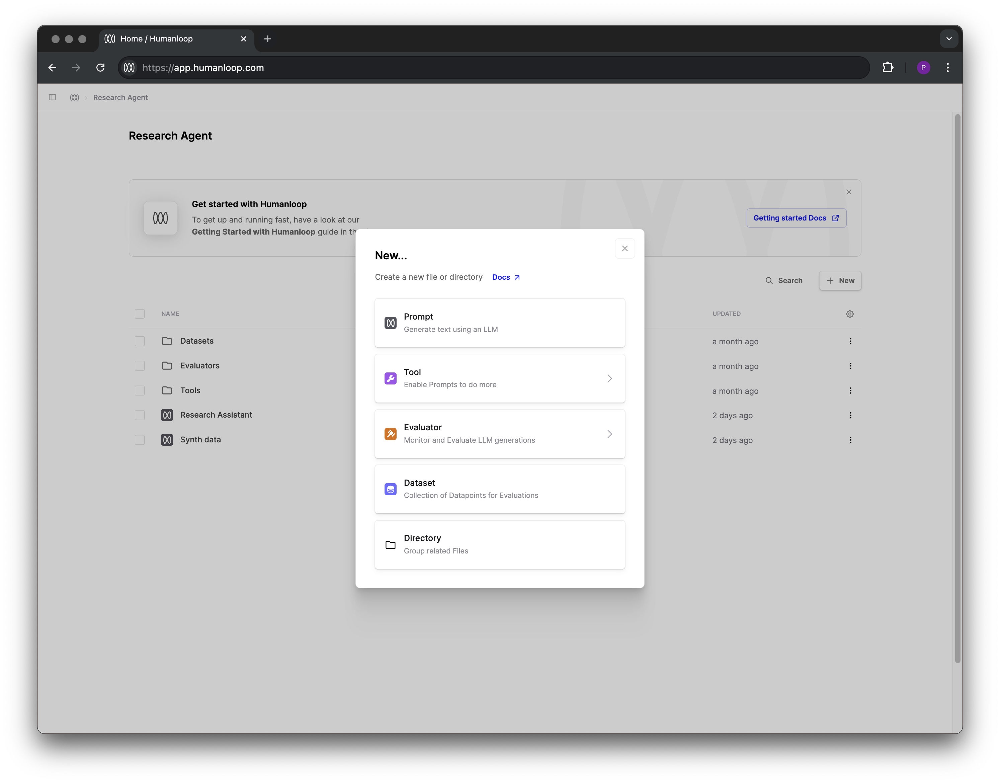

Prompts, Tools and Evaluators are the core building blocks of your AI features on Humanloop:

- [**Prompts**](http://humanloop.com/docs/v5/getting-started/concepts/prompts): Prompts define how a large language model behaves.
- [**Tools**](http://humanloop.com/docs/v5/getting-started/concepts/tools): Tools are functions that can extend your LLMs with access to external data sources and enabling them to take actions.
- [**Evaluators**](http://humanloop.com/docs/v5/getting-started/concepts/evaluators): Evaluators on Humanloop are functions that can be used to judge the output of Prompts, Tools or other Evaluators.

These core building blocks are represented as different file types within a flexible filesystem in your Humanloop organization.

All file types share the following key properties:
- **UI first or code first**: You can create and manage these files in the [Humanloop UI](https://app.humanloop.com/),
or via the [API](http://humanloop.com/docs/v5/api-reference/sd-ks). Product teams and their subject matter experts may prefer utilising the UI first workflows for convenience, whereas AI teams and engineers may prefer to use the API for greater control and customisation.
- **Strict version control**: Files have immutable versions that are uniquely determined by
their parameters that characterise the behaviour of the system. For example, a Prompt version is determined by the prompt template, base model and hyperparameters chosen.
Within the Humanloop Editor and via  the API, you can commit new versions of a file, view the history of changes and revert to a previous version.
- **Flexible runtime**: All files can be called (if you use the Humanloop runtime) or logged to (where you manage the runtime yourself). For example,
with Prompts, Humanloop integrates to all the major [model providers](http://humanloop.com/docs/v5/reference/supported-models). You can choose to call a Prompt, where Humanloop acts as a proxy to the model provider. Alternatively, you can choose to manage the model calls yourself and log the results to the Prompt on Humanloop.
Using the Humanloop runtime is generally the simpler option and allows you to call the file natively within the Humanloop UI, whereas owning the runtime yourself and logging allows you to have more fine-grained control.
- **Composable with sessions**: Files can be combined with other files to create more complex systems like chains and agents. For example, a Prompt can call a Tool, which can then be evaluated by an Evaluator.
The orchestration of more complex systems is best done in code using the API and the full trace of execution is accessible in the Humanloop UI for debugging and evaluation purposes.
- **Serializable**: All files can be exported and imported in a serialized form. For example, Prompts are serialized to our [.prompt](http://humanloop.com/docs/v5/reference/prompt-file-spec) format. This provides a useful medium for more technical teams that wish to maintain the source of truth in their existing version control system like git.
- **Deployment environments**: You can tag file versions with specific environments and target these environments via the UI and API to facilitate robust deployment workflows.

 

Humanloop also has the concept of [Datasets](http://humanloop.com/docs/v5/getting-started/concepts/datasets) that are used within [Evaluation](http://humanloop.com/docs/v5/getting-started/concepts/evaluation) workflows. Datasets share all the same properties, except they do not have a runtime consideration.
