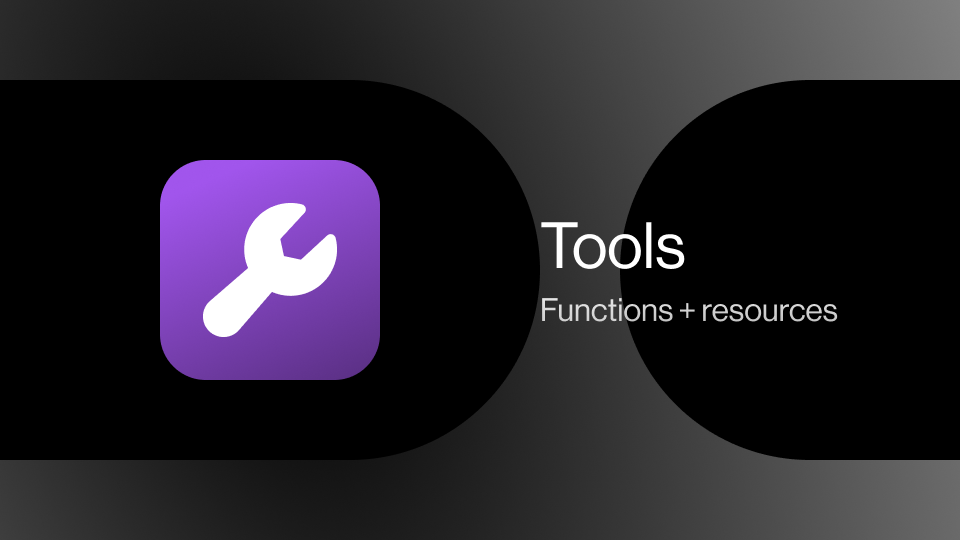

Humanloop Tools can be used in multiple ways:

- by the LLM by [OpenAI function calling](https://platform.openai.com/docs/v5/guides/function-calling))
- within the Prompt template
- as part of a chain of events such as a Retrieval Tool in a RAG pipeline

Some Tools are executable within Humanloop, and these offer the greatest utility and convenience. For example, Humanloop has pre-built integrations for Google search and Pinecone have and so these Tools can be executed and the results inserted into the API or Editor automatically.

### Tool Use (Function Calling)

Certain large language models support tool use or "function calling". For these models, you can supply the description of functions and the model can choose to call one or more of them by providing the values to call the functions with.

 

Tools all have a functional interface that can be supplied as the JSONSchema needed for function calling. Additionally, if the Tool is executable on Humanloop, the result of any tool will automatically be inserted into the response in the API and in the Editor.

Tools for function calling can be defined inline in our Editor or centrally managed for an organization.

### Tools in a Prompt template

You can add a tool call in a prompt template and the result will be inserted into the prompt sent to the model. This allows you to insert retrieved information into your LLMs calls.

For example, if you have **`{{ google("population of india") }}`** in your template, this Google tool will get executed and replaced with the resulting text “**1.42 billion (2024)**” before the prompt is sent to the model. Additionally, if your template contains a Tool call that uses an input variable e.g. **`{{ google(query) }}`** this will take the value of the input supplied in the request, compute the output of the Google tool, and insert that result into the resulting prompt that is sent to the model.

Example of a Tool being used within a Prompt template. This example will mean that this Prompt needs two inputs to be supplied (`query`, and `top_k`)

## Tools within a chain

You can call a Tool within a session of events and post the result to Humanloop. For example in a RAG pipeline, instrumenting your retrieval function as a Tool, enables you to be able to trace through the full sequence of events. The retrieval Tool will be versioned and the logs will be available in the Humanloop UI, enabling you to independently improve that step in the pipeline.

### Supported Tools

### Third-party integrations

- *Pinecone Search* - Vector similarity search using Pinecone vector DB and OpenAI embeddings.
- *Google Search* - API for searching Google: [https://serpapi.com/](https://serpapi.com/).
- *GET API* - Send a GET request to an external API.

### Humanloop tools

- *Snippet Tool* - Create reusable key/value pairs for use in prompts - see [how to use the Snippet Tool](/docs/v5/guides/snippet-tool).
- *JSON Schema* - JSON schema that can be used across multiple Prompts - see [how to link a JSON Schema Tool](/docs/v5/guides/link-jsonschema-tool).
