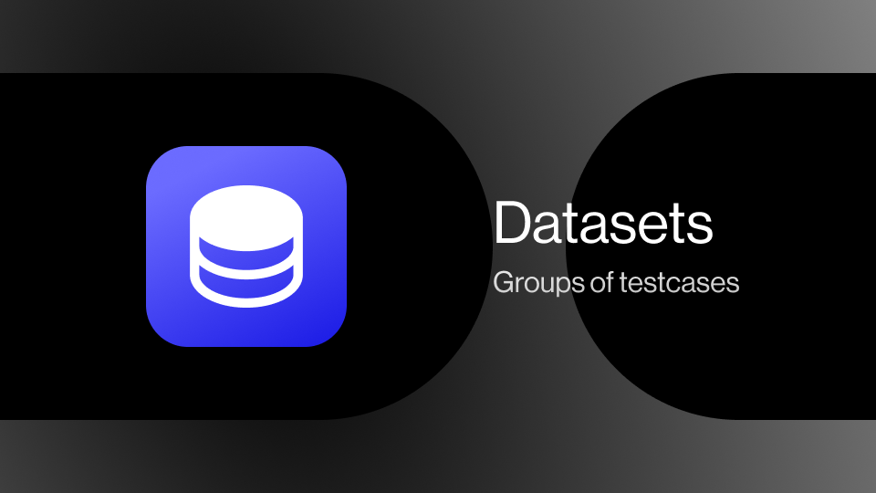
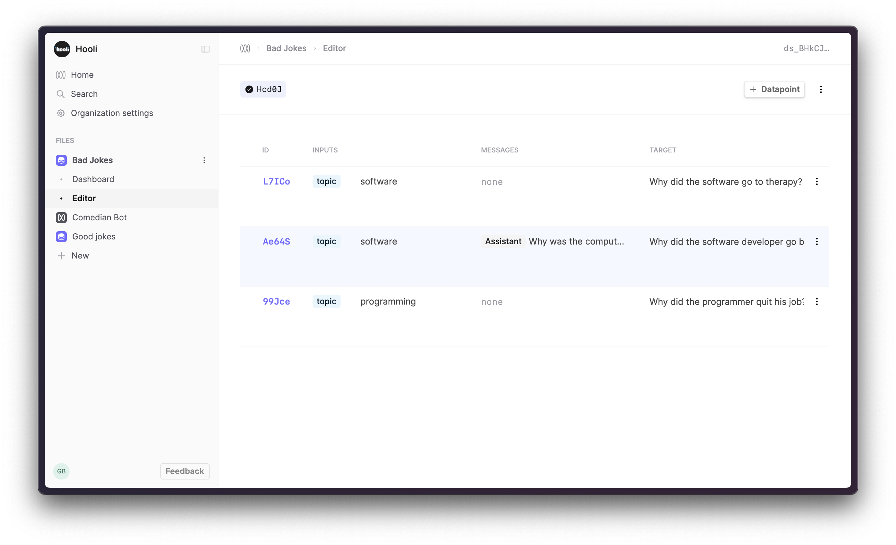

A datapoint consists of three things:

- **Inputs**: a collection of prompt variable values which are interpolated into the prompt template of your model config at generation time (i.e. they replace the `{{ variables }}` you define in the prompt template).
- **Messages**: for chat models, as well as the prompt template, you may have a history of prior chat messages from the same conversation forming part of the input to the next generation. Datapoints can have these messages included as part of the input.
- **Target**: data representing the expected or intended output of the model. In the simplest case, this can simply be a string representing the exact output you hope the model produces for the example represented by the datapoint. In more complex cases, you can define an arbitrary JSON object for `target` with whatever fields are necessary to help you specify the intended behaviour. You can then use our evaluations feature to run the necessary code to compare the actual generated output with your `target` data to determine whether the result was as expected.

 

Datasets can be created via CSV upload, converting from existing Logs in your project, or by API requests.
