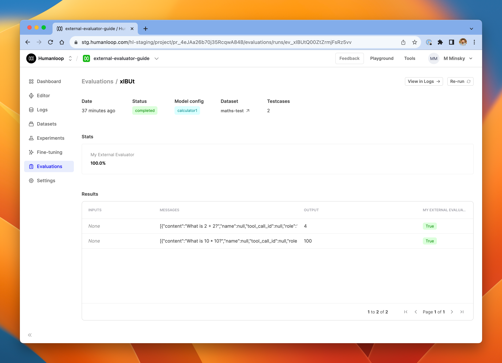

For some use cases, you may wish to run your evaluation process outside of Humanloop, as opposed to running the evaluators we offer in our Humanloop runtime.

For example, you may have implemented an evaluator that uses your own custom model or which has to interact with multiple systems. In these cases, you can continue to leverage the datasets you have curated on Humanloop, as well as consolidate all of the results alongside the prompts you maintain in Humanloop.

In this guide, we'll show an example of setting up a simple script to run such a self-hosted evaluation using our Python SDK.

### Prerequisites

- You need to have access to evaluations
- You also need to have a Prompt – if not, please follow our [Prompt creation](./create-prompt) guide.
- You need to have a dataset in your project. See our [dataset creation](./datasets) guide if you don't yet have one.
- You need to have a model config that you're trying to evaluate - create one in the **Editor**.

### Setting up the script

<Steps>
### Install the latest version of the Humanloop Python SDK:

```shell
pip install humanloop
```

### In a new Python script, import the Humanloop SDK and create an instance of the client:

```python
from humanloop import Humanloop

humanloop = Humanloop(
    api_key=YOUR_API_KEY, # Replace with your API key
)
```

### Retrieve the ID of the Humanloop project you are working in - you can find this in the Humanloop app

```python
PROJECT_ID = ... # Replace with the project ID
```

### Retrieve the dataset you're going to use for evaluation from the project

```python
# Retrieve a dataset
DATASET_ID = ... # Replace with the dataset ID you are using for evaluation (this should be inside the project)
datapoints = humanloop.datasets.list_datapoints(DATASET_ID).records
```

### Create an external evaluator

```python
# Create an external evaluator
evaluator = humanloop.evaluators.create(
    name="My External Evaluator",
    description="An evaluator that runs outside of Humanloop runtime.",
    type="external",
    arguments_type="target_required",
    return_type="boolean",
)
```

### Retrieve the model config you're evaluating

```python
CONFIG_ID = ... # Replace with the model config ID you are evaluating (should be inside the project)
model_config = humanloop.model_configs.get(CONFIG_ID)
```

### Initiate an evaluation run in Humanloop

```python
evaluation_run = humanloop.evaluations.create(
    project_id=PROJECT_ID,
    config_id=CONFIG_ID,
    evaluator_ids=[EVALUATOR_ID],
    dataset_id=DATASET_ID,
)
```

After this step, you'll see a new run in the Humanloop app, under the **Evaluations** tab of your project. It should have status **running**.

### Iterate through the datapoints in your dataset and use the model config to generate logs from them

```python
logs = []
for datapoint in datapoints:
    log = humanloop.chat_model_config(
        project_id=PROJECT_ID,
        model_config_id=model_config.id,
        inputs=datapoint.inputs,
        messages=[
            {key: value for key, value in dict(message).items() if value is not None}
            for message in datapoint.messages
        ],
        source_datapoint_id=datapoint.id,
    ).data[0]
    logs.append((log, datapoint))
```

### Evaluate the logs using your own evaluation logic and post the results back to Humanloop

In this example, we use an extremely simple evaluation function for clarity.

```python
for log, datapoint in logs:
    # The datapoint's 'target' field tells us the correct answer for this datapoint
    expected_answer = str(datapoint.target["answer"])

    # The log output is what the model produced
    model_output = log.output

    # The evaluation is a boolean, indicating whether the model was correct.
    result = expected_answer == model_output

    # Post the result back to Humanloop.
    evaluation_result_log = humanloop.evaluations.log_result(
        log_id=log.id,
        evaluator_id=evaluator.id,
        evaluation_run_external_id=evaluation_run.id,
        result=result,
    )
```

### Mark the evaluation run as completed

```python
humanloop.evaluations.update_status(id=evaluation_run.id, status="completed")
```

</Steps>

## Review the results

After running this script with the appropriate resource IDs (project, dataset, model config), you should see the results in the Humanloop app, right alongside any other evaluations you have performed using the Humanloop runtime.


