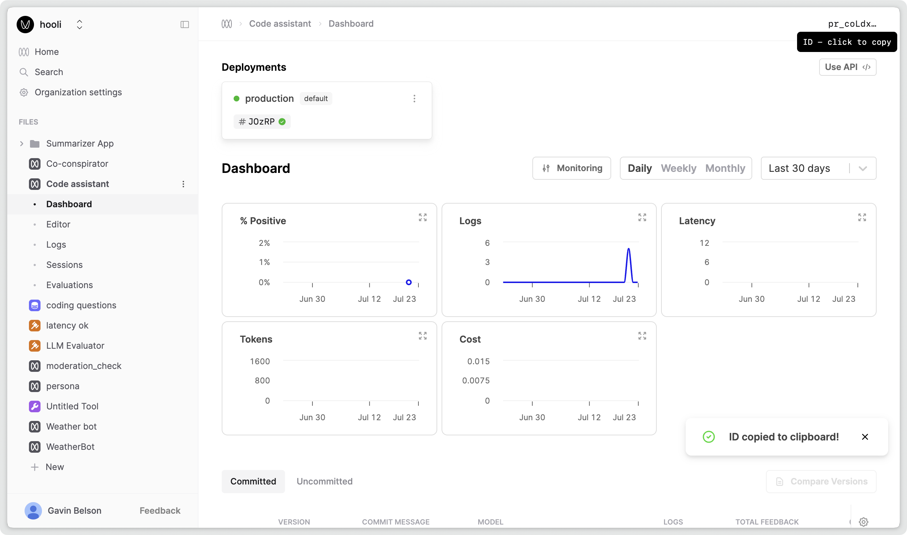

This guide will show you how to call your Prompts as an API, enabling you to generate responses from the large language model that uses the versioned template and parameters. If you want to call an LLM with a prompt that you're defining in code follow the guide on [Calling a LLM through the Humanloop Proxy](/docs/v5/development/guides/proxy-model-calls).

## Call an existing Prompt

### Prerequisites

Before you can use the new `prompt.call()` method, you need to have a Prompt. If you don't have one, please follow our [Prompt creation](/docs/v5/development/guides/create-prompt) guide first.

<Markdown src="../../../snippets/setup-sdk.mdx" />

<Steps>

### Get the Prompt ID

In Humanloop, navigate to the Prompt and copy the Prompt ID by clicking on the ID in the top right corner of the screen.

### Use the SDK to call your model

Now you can use the SDK to generate completions and log the results to your Prompt using the new `prompt.call()` method:

<EndpointRequestSnippet endpoint="POST /prompts/call" example="By ID" />

<EndpointResponseSnippet endpoint="POST /prompts/call" example="By ID" />

### Navigate to the **Logs** tab of the Prompt

And you'll be able to see the recorded inputs, messages and responses of your chat.

</Steps>

## Call the LLM with a prompt that you're defining in code

<EndpointRequestSnippet
  endpoint="POST /prompts/call"
  example="Supplying Prompt"
/>

<EndpointResponseSnippet
  endpoint="POST /prompts/call"
  example="Supplying Prompt"
/>

🎉 Now that you have chat messages flowing through your Prompt you can start to log your end user feedback to evaluate and improve your models.
