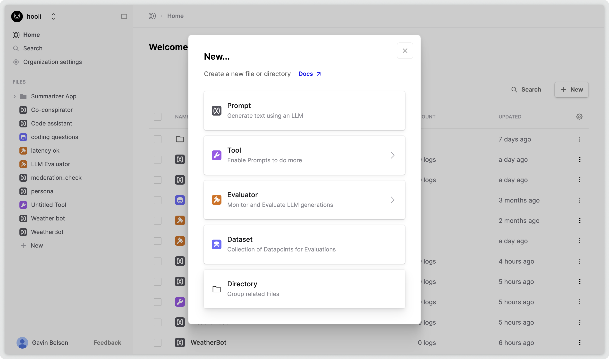

This guide will show you how to create a [Directory](/docs/v5/concepts/directories) in the UI. A directory is a collection of files and other directories.

<Markdown src="../../../snippets/prereq-have-account.mdx" />

## Create a Directory

<Steps>
### Create a Directory

1. Open Humanloop and navigate to the File navigation on the left.
2. Click '**+ New**' and select **Directory**.
3. Name your new directory, for example, "Summarization App".

<Callout>
  You can call files and directories anything you want. Capital letters, spaces
  are all ok!
</Callout>

### (Optional) Move a File into the Directory

1. In the File navigation sidebar, right-click on the file in the sidebar and select "Move" from the context menu
2. Choose the destination directory

</Steps>

You have now successfully created a directory and moved a file into it. This organization can help you manage your projects more efficiently within Humanloop.
