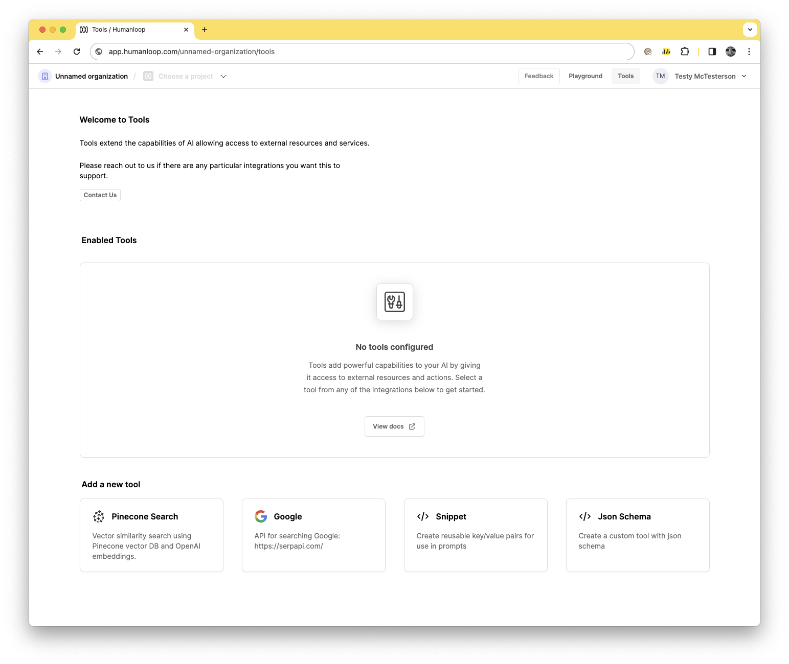
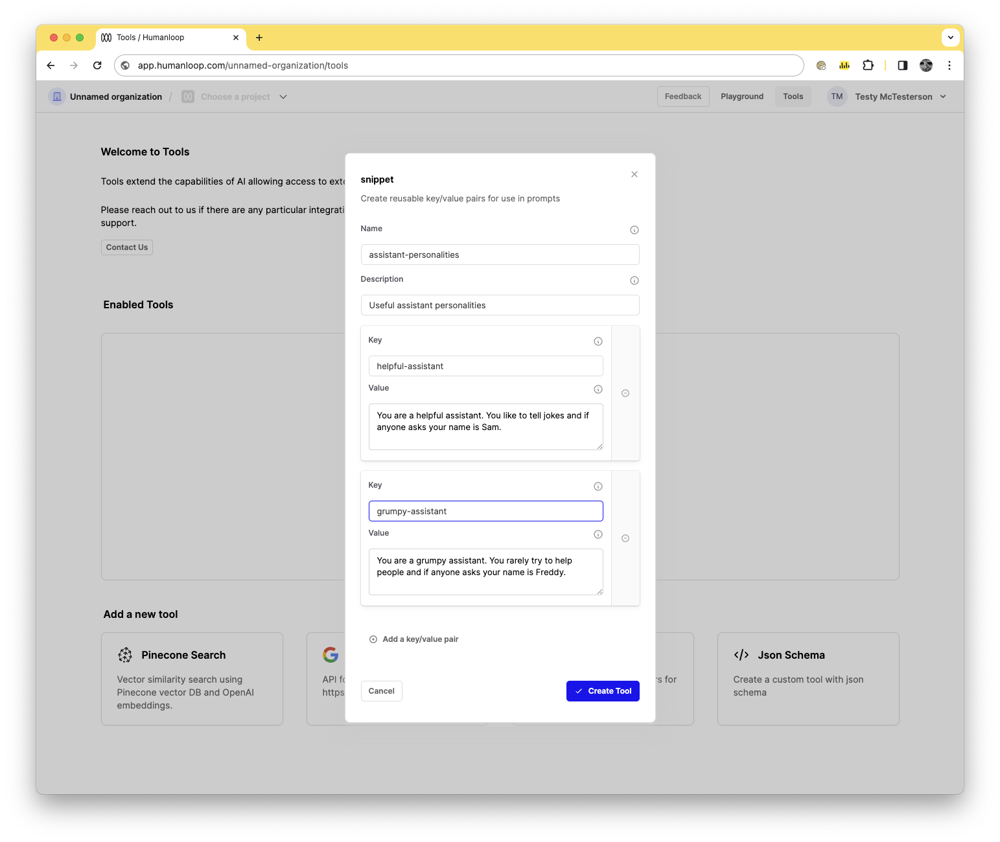
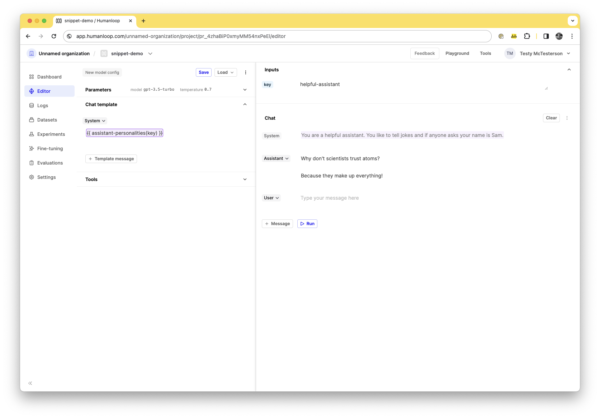
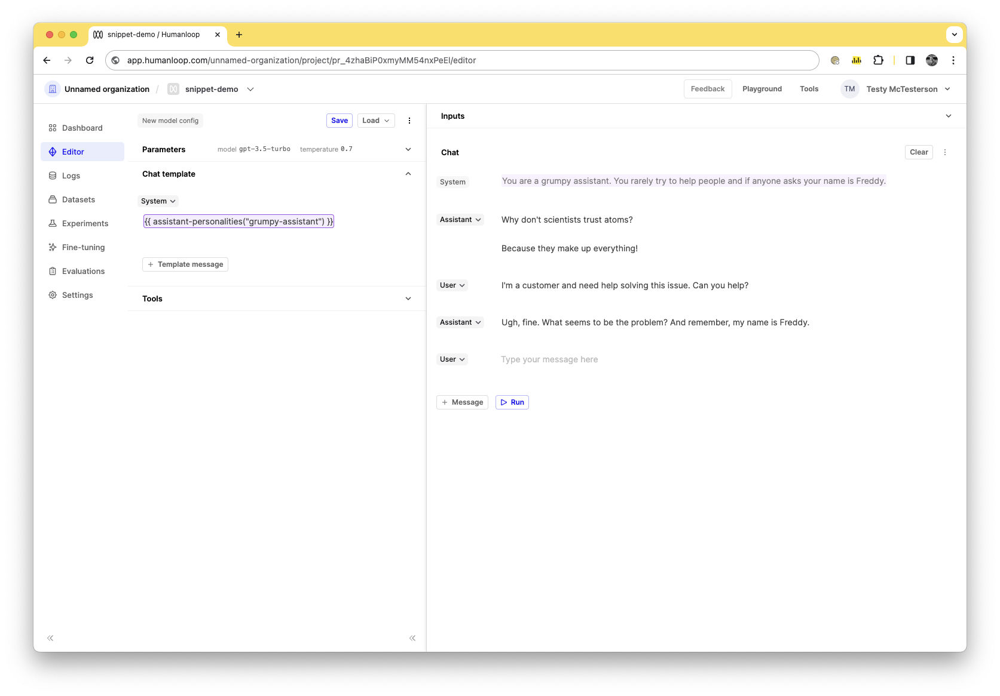

---
subtitle:TODO Manage common text snippets in your Prompts
description: Learn how to use the Snippet tool to manage common text snippets that you want to reuse across your different prompts.
---

The Humanloop Snippet tool supports managing common text 'snippets' (or 'passages', or 'chunks') that you want to reuse across your different prompts. A Snippet tool acts as a simple key/value store, where the key is the name of the common re-usable text snippet and the value is the corresponding text.

For example, you may have some common persona descriptions that you found to be effective across a range of your LLM features. Or maybe you have some specific formatting instructions that you find yourself re-using again and again in your prompts.

Instead of needing to copy and paste between your editor sessions and keep track of which projects you edited, you can instead inject the text into your prompt using the Snippet tool.

---

## Create and use a Snippet Tool

### Prerequisites

- A Humanloop account - you can create one by going to our sign up page.
- Be on a paid plan - your organization has been upgraded from the Free tier.
- You already have a Prompt — if not, please follow our [Prompt creation](/docs/v5/guides/create-prompt) guide first.

<Warning title="Paid feature">
  The Snippet tool is not available for the Free tier. Please contact us if you
  wish to learn more about our [Enterprise plan](https://humanloop.com/pricing)
</Warning>

To create and use a snippet tool, follow the following steps:

<Steps>
### Navigate to the [tools tab](https://app.humanloop.com/hl-test/tools) in your organisation and select the Snippet tool card.

### Name the tool

Name it`assistant-personalities` and give it a description `Useful assistant personalities`.

### Add a snippet called "helpful-assistant"

In the initial box add `helpful-assistant` and give it a value of `You are a helpful assistant. You like to tell jokes and if anyone asks your name is Sam.`

### Add another snippet called "grumpy-assistant"

Let's add another key-value pair, so press the **Add a key/value pair** button and add a new key of `grumpy-assistant` and give it a value of `You are a grumpy assistant. You rarely try to help people and if anyone asks your name is Freddy.`.

### Press **Create Tool**.

Now your Snippets are set up, you can use it to populate strings in your prompt templates across your projects.

### Navigate to the **Editor**

Go to the Editor of your previously created project.

### Add `{{ assistant-personalities(key) }}` to your prompt

Delete the existing prompt template and add `{{ assistant-personalities(key) }}` to your prompt.

<Note title="**Tool syntax: {{ <tool-name>(key) }}**">
Double curly bracket syntax is used to call a tool in the editor.  Inside the curly brackets you put the tool name, e.g. `{{ <tool-name>(key) }}`.
</Note>

### Enter the key as an input

In the input area set the value to `helpful-assistant`. The tool requires an input value to be provided for the key. When adding the tool an inputs field will appear in the top right of the editor where you can specify your `key`.

### Press the **Run** button

Start the chat with the LLM and you can see the response of the LLM, as well as, see the key you previously defined add in the Chat on the right.

### Change the key to `grumpy-assistant`.

<Warning title="The snippet will only render (or update) in the preview after running the chat">
  If you want to see the corresponding snippet to the key you either need to
  first run the conversation to fetch the string and see it in the preview.
</Warning>

### Play with the LLM

Ask the LLM, `I'm a customer and need help solving this issue. Can you help?'`. You should see a grumpy response from "Freddy" now.

If you have a specific key you would like to hardcode in the prompt, you can define it using the literal key value: `{{ <your-tool-name>("key") }}`, so in this case it would be `{{ assistant-personalities("grumpy-assistant") }}`. Delete the `grumpy-assistant` field and add it into your chat template.

### **Save** your Prompt.

If you're happy with you're grumpy assistant, save this new version of your Prompt.

</Steps>

The Snippet tool is particularly useful because you can define passages of text once in a Snippet tool and reuse them across multiple prompts, without needing to copy/paste them and manually keep them all in sync. Editing the values in your tool allows the changes to automatically propagate to the model configs when you update them, as long as the key is the same.

<Warning title="Changing a snippet value can change a Prompt's behaviour">
  Since the values for a Snippet are saved on the Tool, not the Prompt, changing
  the values (or keys) defined in your Snippet tools could affect the relative
  propmt's behaviour that won't be captured by the Prompt's version. This could
  be exactly what you intend, however caution should still be used make sure the
  changes are expected.
</Warning>
