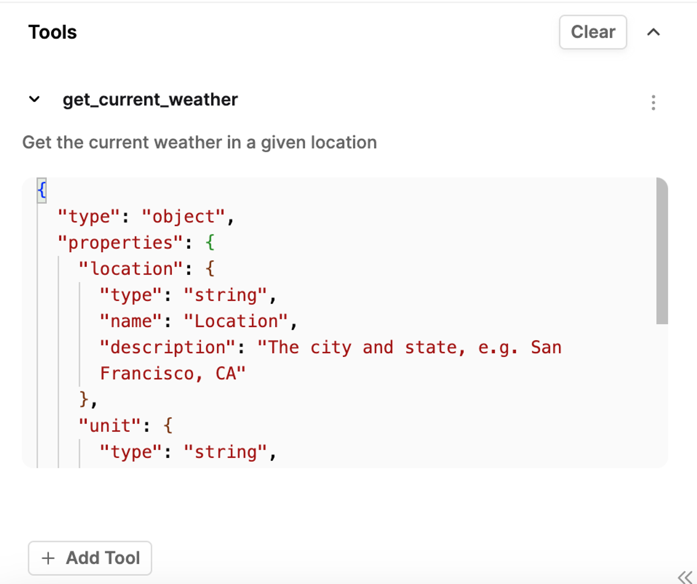

This guide will explain how the basics of prompt engineering and how call your Prompts on Humanloop.

Prompts are callable either as an API (via the Humanloop proxy) or you can use the SDK to call the model provider directly and log the data to Humanloop asynchronously.

## Using Prompts

Once you have created your Prompt, you can call it as an API to generate responses from the large language model directly.
You supply and query-time data such as input values or user messages, and the model will respond with its text output.

<EndpointRequestSnippet endpoint="POST /prompts/call" />

Alternatively, you can log directly to Humanloop with the `POST /prompts/log` endpoint. This enables you to manage calling the model provider and logging the data seperately, while still versioning the Prompts in Humanloop and benefiting from the evaluation features.

## Proxying your LLM calls vs async logging

The easiest way to both call the large language model with your Prompt and to log the data is to use the `Prompt.call()` method (see the guide on [Calling a Prompt](/docs/development/guides/call-prompt)) which will do both in a single API request. However, there are two main reasons why you may wish to log the data seperately from generation:

1. You are using your own model that is not natively supported in the Humanloop runtime.
2. You wish to avoid relying on Humanloop runtime as the proxied calls adds a small additional latency, or

The `prompt.call()` Api encapsulates the LLM provider calls (for example `openai.Completions.create()`), the model-config selection and logging steps in a single unified interface. There may be scenarios that you wish to manage the LLM provider calls directly in your own code instead of relying on Humanloop.

Humanloop provides a comprehensive platform for developing, managing, and versioning Prompts, Tools and your other artifacts of you AI systems. This explainer will show you how to create, version and manage your Prompts, Tools and other artifacts.

You can also use Prompts without proxying through Humanloop to the model provider and instead call the model yourself and explicitly log the results to your Prompt.

<EndpointRequestSnippet endpoint="POST /prompts/log" />

## Prompt Engineering

Understanding the best practices for working with large language models can significantly enhance your application's performance. Each model has its own failure modes, and the methods to address or mitigate these issues are not always straightforward. The field of "prompt engineering" has evolved beyond just crafting prompts to encompass designing systems that incorporate model queries as integral components.

For a start, read our [Prompt Engineering 101](https://humanloop.com/blog/prompt-engineering-101) guide which covers techniques to improve model reasoning, reduce the chances of model hallucinations, and more.

### Prompt templates

Inputs are defined in the template through the double-curly bracket syntax e.g. `{{topic}}` and the value of the variable will need to be supplied when you call the Prompt to create a generation.

```text
Property context:

Location: {{location}}
Number of Bedrooms: {{number_of_bedrooms}}
Number of Bathrooms: {{number_of_bathrooms}}
Square Footage: {{square_footage}}
Distance to Key Locations (e.g., downtown, beach): {{distance_to_key_locations}}
Year Built: {{year_built}}
Price: {{price}}
Contact Information: {{contact_information}}
Instructions:
Generate a marketing description for the property based on the provided context. The description should be between 150-200 words and have a friendly, engaging tone. Highlight the key features and amenities that make this property attractive to potential buyers. Ensure the copy is informative and enticing, encouraging readers to take action.
```

This separation of concerns, keeping configuration separate from the query time data, is crucial for enabling you to experiment with different configurations and evaluate any changes.
The Prompt stores the configuration and the query time data in [Logs](../concepts/logs), which can then be used to create Datasets for evaluation purposes.

### Tool Use (Function Calling)

Certain large language models support tool use or "function calling". For these models, you can supply the description of functions and the model can choose to call one or more of them by providing the values to call the functions with.

Function calling enables the model to perform various tasks:

**1. Call external APIs**: The model can translate natural language into API calls, allowing it to interact with external services and retrieve information.

**2. Take actions**: The model can exhibit agentic behavior, making decisions and taking actions based on the given context.

**3. Provide structured output**: The model's responses can be constrained to a specific structured format, ensuring consistency and ease of parsing in downstream applications.



Tools for function calling can be defined inline in the Prompt editor in which case they form part of the Prompt version. Alternatively, they can be pulled out in a Tool file which is then referenced in the Prompt.

Each Tool has functional interface that can be supplied as the _JSON Schema_ needed for function calling. Additionally, if the Tool is executable on Humanloop, the result of any tool will automatically be inserted into the response in the API and in the Editor.

## Dealing with sensitive data

{/* WIP - for gartner /start */}

When working with sensitive data in your AI applications, it's crucial to handle it securely. Humanloop provides options to help you manage sensitive information while still benefiting from our platform's features.

If you need to process sensitive data without storing it in Humanloop, you can use the `save: false` parameter when making calls to the API or logging data. This ensures that only metadata about the request is stored, while the actual sensitive content is not persisted in our systems.

For PII detection, you can set up [Guardrails](/docs/observability/alerts-and-guardrails) to detect and prevent the generation of sensitive information.

{/* WIP - for gartner /end */}
