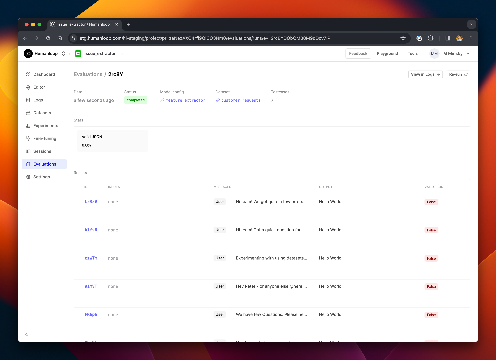

If you are running your own infrastructure to generate logs, you can still leverage the Humanloop evaluations suite via our API. The workflow looks like this:

1. Trigger creation of an evaluation run
2. Loop through the datapoints in your dataset and perform generations on your side
3. Post the generated logs to the evaluation run

This works with any evaluator - if you have configured a Humanloop-runtime evaluator, these will be automatically run on each log you post to the evaluation run; or, you can use self-hosted evaluators and post the results to the evaluation run yourself (see [Self-hosted evaluations](./self-hosted-evaluations)).

## Prerequisites

- You need to have access to evaluations
- You also need to have a project created - if not, please first follow our project creation guides.
- You need to have a dataset in your project. See our dataset creation guide if you don't yet have one.
- You need to have a model config that you're trying to evaluate - create one in the Editor.

## Setting up the script

<Steps>

### Install the latest version of the Humanloop Python SDK

```shell
pip install humanloop
```

### In a new Python script, import the Humanloop SDK and create an instance of the client

```python
humanloop = Humanloop(
    api_key=YOUR_API_KEY, # Replace with your Humanloop API key
)
```

### Retrieve the ID of the Humanloop project you are working in

You can find this in the Humanloop app.

```python
PROJECT_ID = ... # Replace with the project ID
```

### Retrieve the dataset you're going to use for evaluation from the project

```python
# Retrieve a dataset
DATASET_ID = ... # Replace with the dataset ID you are using for evaluation.
								 # This must be a dataset in the project you are working in.
datapoints = humanloop.datasets.list_datapoints(DATASET_ID).records
```

### Set up the model config you are evaluating

If you constructed this in Humanloop, retrieve by calling:

```python
config = humanloop.model_configs.get(id=CONFIG_ID)
```

Alternatively, if your model config lives outside the Humanloop system, you can post it to Humanloop with the [register model config endpoint](/api-reference/model-configs/model-configs-register).

Either way, you need the ID of the config.

```python
CONFIG_ID = <YOUR_CONFIG_ID>
```

### In the Humanloop app, create an evaluator

For this guide, we'll simply create a **Valid JSON** checker.

1. Visit the **Evaluations** tab, and select **Evaluators**
2. Click **+ New Evaluator** and choose **Code** from the options.
3. Select the **Valid JSON** preset on the left.
4. Choose the mode **Offline** in the setting panel on the left.
5. Click **Create**.
6. Copy your new evaluator's ID from the address bar. It starts with `evfn_`.

```python
EVALUATOR_ID = <YOUR_EVALUATOR_ID>
```

### Create an evaluation run with `hl_generated` set to `False`

This tells the Humanloop runtime that it should not trigger evaluations itself, but wait for them to be posted via the API.

```python
evaluation_run = humanloop.evaluations.create(
    project_id=PROJECT_ID,
    config_id=CONFIG_ID,
    dataset_id=DATASET_ID,
    evaluator_ids=[EVALUATOR_ID],
    hl_generated=False,
)
```

By default, the status of the evaluation after creation is `pending`. Before sending the generation logs, set the status to `running`.

```python
humanloop.evaluations.update_status(id=evaluation_run.id, status="running")
```

### Iterate through the datapoints in the dataset, produce a generation, and post it the evaluation

```python
for datapoint in datapoints:
		# Use the datapoint to produce a log with the model config you are testing.
    # This will depend on whatever model calling setup you are using on your side.
    # For simplicity, we simply log a hardcoded
    log = {
        "project_id": PROJECT_ID,
        "config_id": CONFIG_ID,
        "messages":  [*config.chat_template, *datapoint.messages],
        "output": "Hello World!",
    }

    print(f"Logging generation for datapoint {datapoint.id}")
    humanloop.evaluations.log(
        evaluation_id=evaluation_run.id,
        log=log,
        datapoint_id=datapoint.id,
    )
```

#### Run the full script above.

If everything goes well, you should now have posted a new evaluation run to Humanloop, and logged all the generations derived from the underlying datapoints.

The Humanloop evaluation runtime will now iterate through those logs and run the **Valid JSON** evaluator on each of them. To check progress:

### Visit your project in the Humanloop app and go to the **Evaluations** tab.

You should see the run you recently created; click through to it and you'll see rows in the table showing the generations.

<Frame>
  
</Frame>

In this case, all the evaluations returned `False` because the string "Hello World!" wasn't valid JSON. Try logging something which is valid JSON to check that everything works as expected.

</Steps>

## Full Script

For reference, here's the full script you can use to get started quickly.

```python
from humanloop import Humanloop

API_KEY = <YOUR_API_KEY>

humanloop = Humanloop(
    api_key=API_KEY,
)

PROJECT_ID = <YOUR_PROJECT_ID>
DATASET_ID = <YOUR_DATASET_ID>
CONFIG_ID = <YOUR_CONFIG_ID>
EVALUATOR_ID = <YOUR_EVALUATOR_ID>

# Retrieve the datapoints in the dataset.
datapoints = humanloop.datasets.list_datapoints(dataset_id=DATASET_ID).records

# Retrieve the model config
config = humanloop.model_configs.get(id=CONFIG_ID)

# Create the evaluation run
evaluation_run = humanloop.evaluations.create(
    project_id=PROJECT_ID,
    config_id=CONFIG_ID,
    dataset_id=DATASET_ID,
    evaluator_ids=[EVALUATOR_ID],
    hl_generated=False,
)
print(f"Started evaluation run {evaluation_run.id}")

# Set the status of the run to running.
humanloop.evaluations.update_status(id=evaluation_run.id, status="running")

# Iterate the datapoints and log a generation for each one.
for i, datapoint in enumerate(datapoints):
		# Produce the log somehow. This is up to you and your external setup!
  	log = {
        "project_id": PROJECT_ID,
        "config_id": CONFIG_ID,
        "messages":  [*config.chat_template, *datapoint.messages],
        "output": "Hello World!", # Hardcoded example for demonstration..
    }

    print(f"Logging generation for datapoint {datapoint.id}")
    humanloop.evaluations.log(
        evaluation_id=evaluation_run.id,
        log=log,
        datapoint_id=datapoint.id,
    )

print(f"Completed evaluation run {evaluation_run.id}")
```

<Info>
  It's also a good practice to wrap the above code in a try-except block and to
  mark the evaluation run as failed (using `update_status`) if an exception
  causes something to fail.
</Info>
