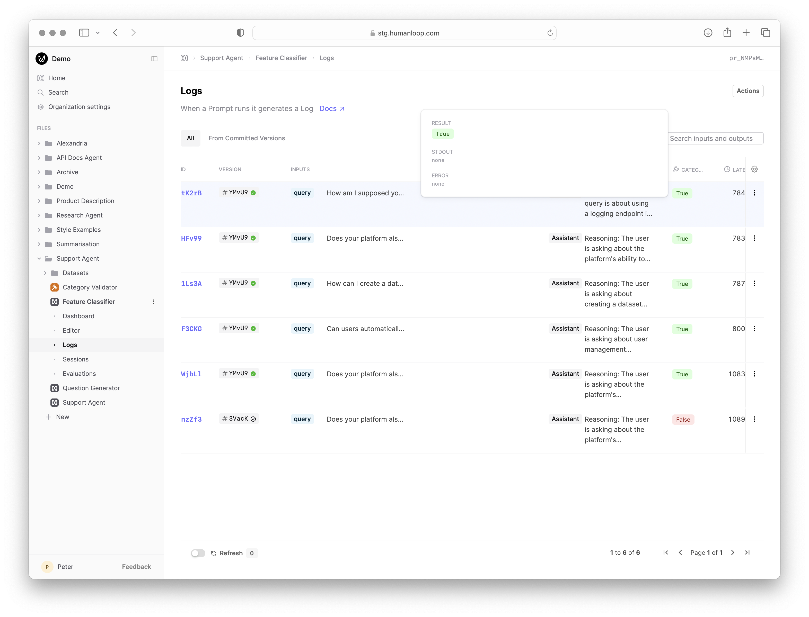

A code [Evaluator](../../concepts/evaluators) is a Python function that takes a generated [Log](../../concepts/logs) (and optionally a testcase [Datapoint](../../concepts/datasets) if comparing to expected results) as input and returns a **judgement**.
The judgement is in the form of a boolean or number that measures some criteria of the generated Log defined within the code.

Code Evaluators provide a flexible way to evaluate the performance of your AI applications, allowing you to re-use existing evaluation packages as well as define custom evaluation heuristics.

We support a fully featured Python environment; details on the supported packages can be found in the [environment reference](/docs/v5/reference/python-environment)

### Prerequisites

You should have an existing [Prompt](../../concepts/prompts) to evaluate and already generated some [Logs](../../concepts/logs).
Follow our guide on [creating a Prompt](../../development/guides/create-prompt).

In this example, we'll reference a Prompt that categorises a user query about Humanloop's product and docs by which feature it relates to.


## Create a code Evaluator

<Steps>

### Create a new Evaluator

- Click the **New** button at the bottom of the left-hand sidebar, select **Evaluator**, then select **Code**.


- Give the Evaluator a name when prompted in the sidebar, for example `Category Validator`.

### Define the Evaluator code

After creating the Evaluator, you will automatically be taken to the code editor.
For this example, our Evaluator will check that the feature category returned by the Prompt is from the list of allowed feature categories. We want to ensure our categoriser isn't hallucinating new features.

- Make sure the **Mode** of the Evaluator is set to **Online** in the options on the left.
- Copy and paste the following code into the code editor:

```python Python

ALLOWED_FEATURES = [
    "Prompt Editor",
    "Model Integrations",
    "Online Monitoring",
    "Offline Evaluations",
    "Dataset Management",
    "User Management",
    "Roles Based Access Control",
    "Deployment Options",
    "Collaboration",
    "Agents and chaining"
]

def validate_feature(log):
    print(f"Full log output: \n {log['output']}")
    # Parse the final line of the log output to get the returned category
    feature = log["output"].split("\n")[-1]
    return feature in ALLOWED_FEATURES
```

<Info title="Code Organisation">
  You can define multiple functions in the code Editor to organize your
  evaluation logic. The final function defined is used as the main Evaluator
  entry point that takes the Log argument and returns a valid judgement.
</Info>

### Debug the code with Prompt Logs

- In the debug console beneath where you pasted the code, click **Select Prompt or Dataset** and find and select the Prompt you're evaluating.
  The debug console will load a sample of Logs from that Prompt.


- Click the **Run** button at the far right of one of the loaded Logs to trigger a debug run. This causes the code to be executed with the selected Log as input and populates the **Result** column.
- Inspect the output of the executed code by selecting the arrow to the right of **Result**.


### Commit the code

Now that you've validated the behaviour, commit the code by selecting the **Commit** button at the top right of the Editor and provide a suitable commit message describing your changes.

### Inspect Evaluator logs

Navigate to the **Logs** tab of the Evaluator to see and debug all the historic usages of this Evaluator.


</Steps>

## Monitor a Prompt

Now that you have an Evaluator, you can use it to monitor the performance of your Prompt by linking it so that it is automatically run on new Logs.

<Steps>

### Link the Evaluator to the Prompt

- Navigate to the **Dashboard** of your Prompt
- Select the **Monitoring** button above the graph and select **Connect Evaluators**.
- Find and select the Evaluator you just created and click **Chose**.


<Info title="Linking Evaluators for Monitoring">
  You can link to a deployed version of the Evaluator by choosing the
  environment such as `production`, or you can link to a specific version of the
  Evaluator. If you want changes deployed to your Evaluator to be automatically
  reflected in Monitoring, link to the environment, otherwise link to a specific
  version.
</Info>

This linking results in: - An additional graph on your Prompt dashboard showing the Evaluator results over time. - An additional column in your Prompt Versions table showing the aggregated Evaluator results for each version. - An additional column in your Logs table showing the Evaluator results for each Log.

### Generate new Logs

Navigate to the **Editor** tab of your Prompt and generate a new Log by entering a query and clicking **Run**.

### Inspect the Monitoring results

Navigate to the **Logs** tab of your Prompt and see the result of the linked Evaluator against the new Log. You can filter on this value in order to [create a Dataset](./create-dataset) of interesting examples.



</Steps>

## Next steps

- Explore [AI Evaluators](./llm-as-a-judge) and [Human Evaluators](./human-evaluators) to complement your code-based judgements for more qualitative and subjective criteria.
- Combine your Evaluator with a [Dataset](../../concepts/datasets) to run [Evaluations](./run-evaluation) to systematically compare the performance of different versions of your AI application.
