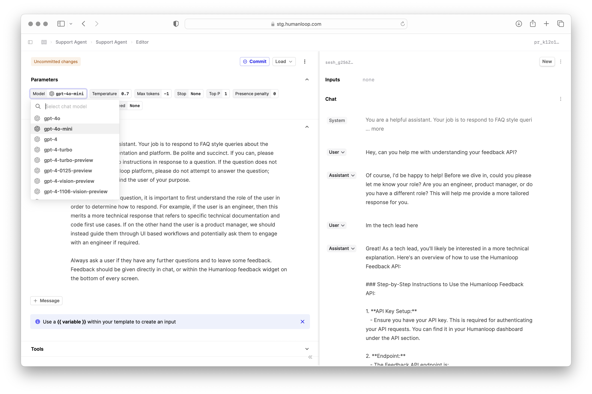
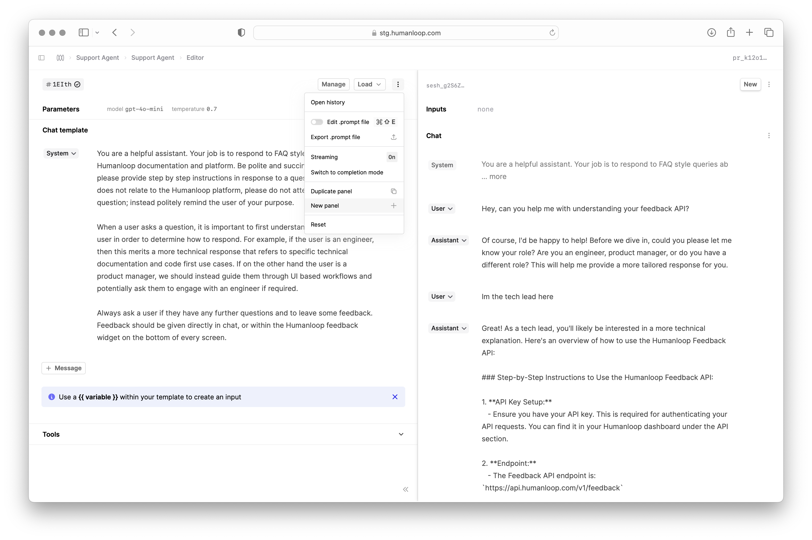
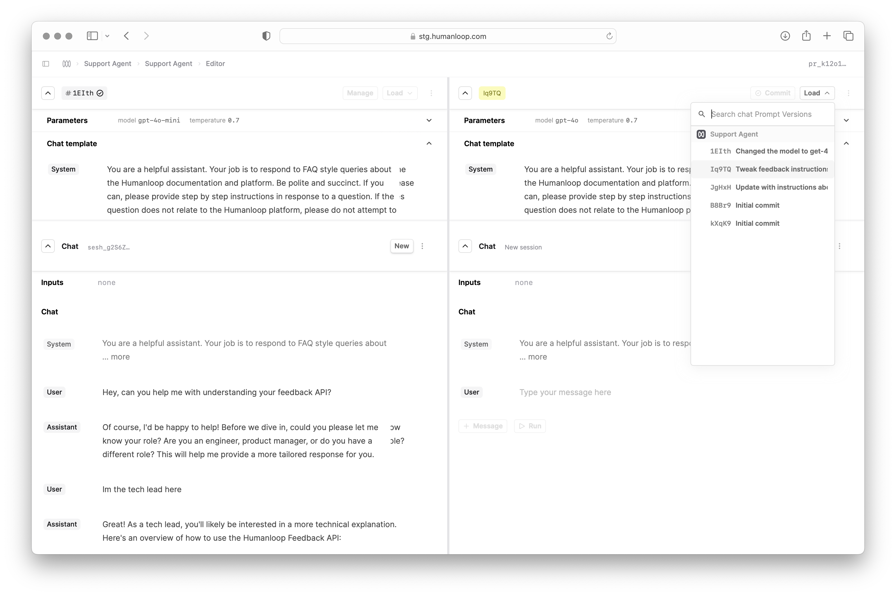
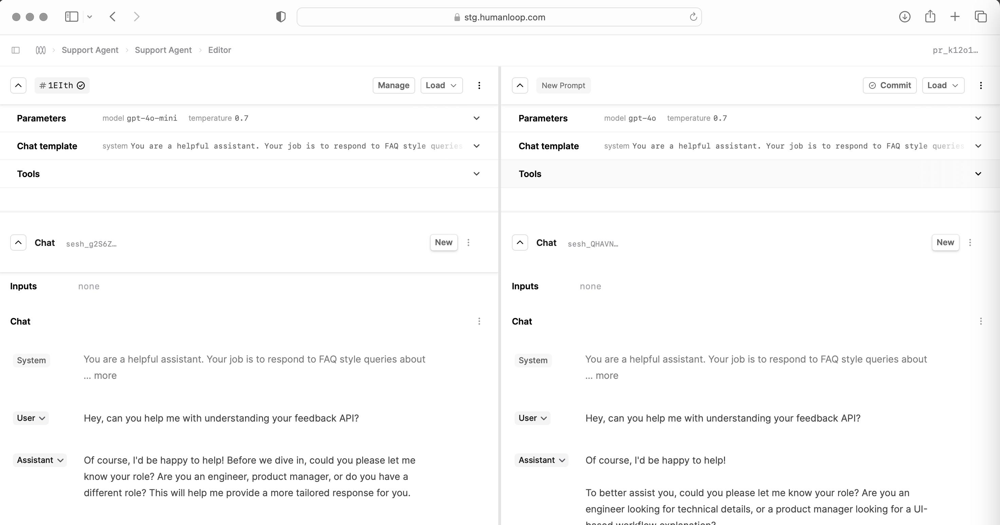
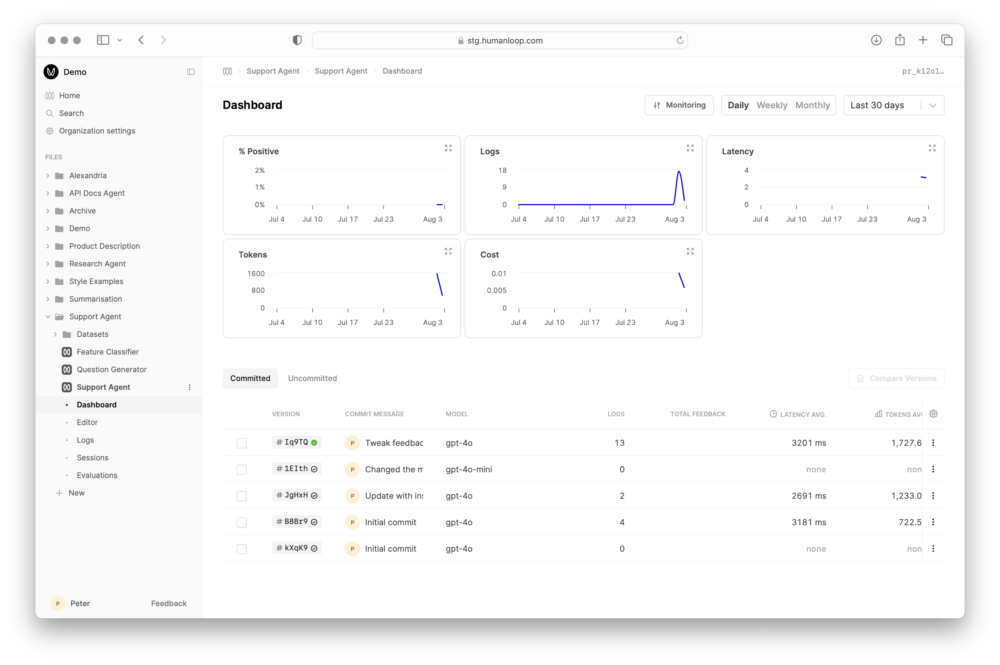
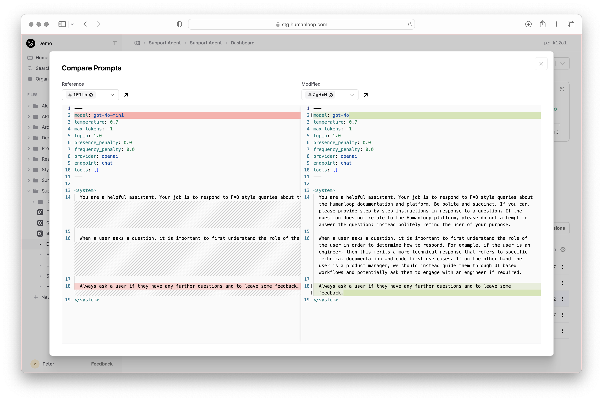

You can compare Prompt versions interactively side-by-side to get a sense for how their behaviour differs; before then triggering more systematic [Evaluations](./run-evaluation).
All the interactions in Editor are stored as Logs within your Prompt and can be inspected further and [added to a Dataset](./create-dataset#create-a-dataset-from-logs) for Evaluations.

## Prerequisites

<Markdown src="../../../snippets/prereq-point-prompt.mdx" />

## Compare Prompt versions

In this example we will use a simple Support Agent Prompt that answers user queries about Humanloop's product and docs.


<Steps>
    ### Create a new version of your Prompt
    Open your Prompt in the Editor and expand **Parameters** and change some details such as the choice of `Model`.
    In this example, we change from `gpt-4o` to `gpt-4o-mini`.
    This will create a new uncommitted version of the Prompt.

    

    Now commit the new version of your Prompt by selecting the blue **Commit** button over **Parameters** and providing a helpful commit message like:
    ```text
    Changed model to gpt-4o-mini
    ```

    ### Load up two versions of your Prompt in the Editor
    To load up the previous version side-by-side, select the menu beside the Load button and select the **New panel** option (depending on your screen real-estate, you can add more than 2 panels).
    

    Then select to *Load* button in the new panel and select another version of your Prompt to compare.

    

    ### Compare the outputs of both versions

    Now you can run the same user messages through both models to compare their behaviours live side-by-side.

    

</Steps>


## View Prompt diff for debugging

When debugging more complex Prompts, it's important to understand what changes were made between different versions. Humanloop provides a diff view to support this.

<Steps>

### Navigate to your Prompt dashboard

In the sidebar, select the **Dashboard** section under your Prompt file, where you will find a table of all your historic Prompt versions.



### Select the versions to compare

In the table, select two rows you would like understand the changes between. Then select the **Compare Versions** button above the table.




</Steps>


1. While in the **Compare** tab, look for the **Diff** section.
2. This section will highlight the changes made between the selected versions, showing additions, deletions, and modifications.
3. Use this diff view to understand how specific changes in your prompt configuration affect the output.

By following these steps, you can effectively compare different versions of your Prompts and iterate on your instructions to improve performance.


