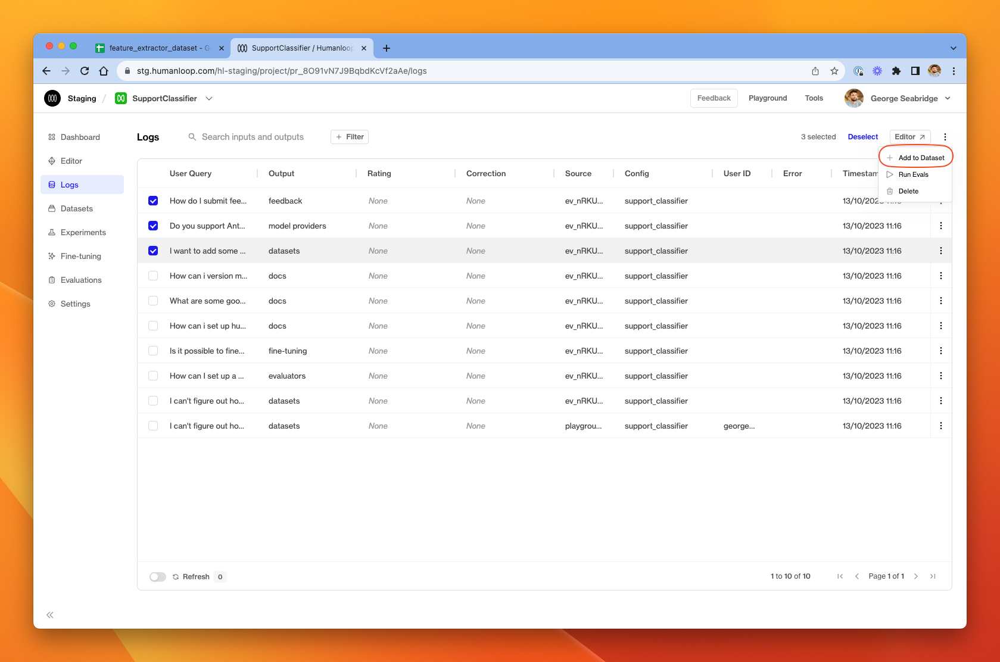
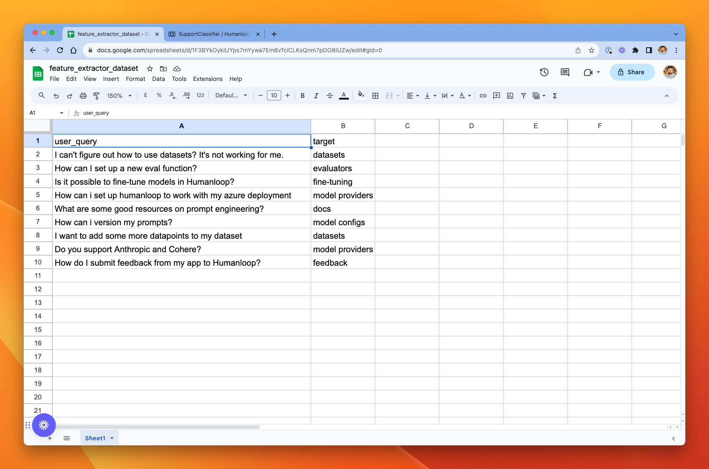
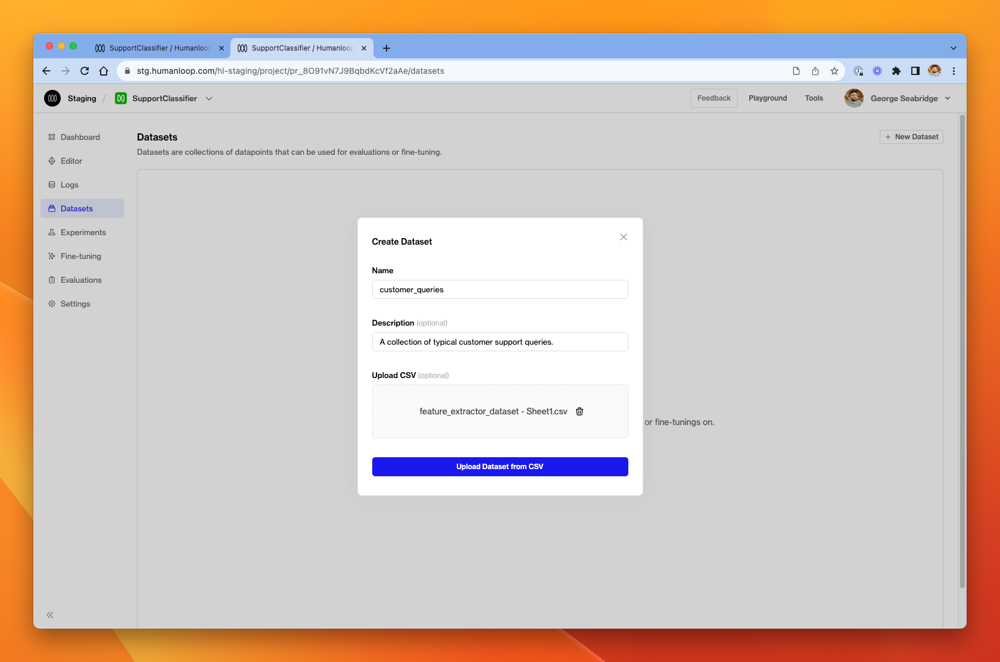
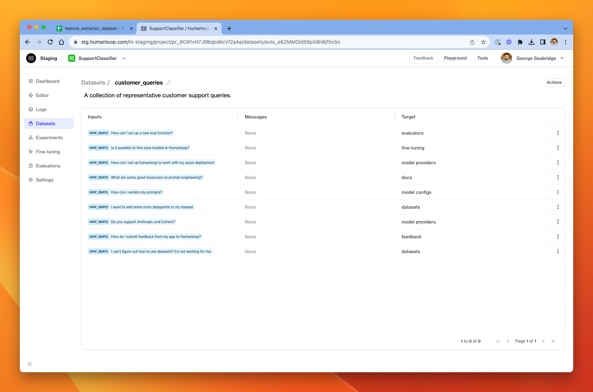
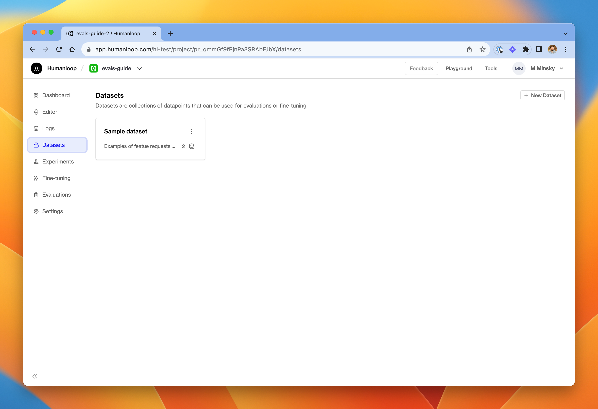

You can currently create Datasets in Humanloop in three ways: from existing **logs**, by uploading a **CSV** or via the **API**.

# Create a Dataset from Logs

Prerequisites:

- A [Prompt](/docs/v5/prompts) in Humanloop
- Some [Logs](./generate-and-log-with-the-sdk) available in that Prompt

To create a Dataset from existing Logs:

<Steps>

### Go to the **Logs** tab

### Select a subset of the Logs

### Choose **Add to Dataset**

In the menu in the top right of the page, select **Add to dataset**.

### Add to a new or existing Dataset

Provide a name of the new dataset and click **Create**, or you can click **add to existing dataset** to append the selected to a dataset you already have.

</Steps>

# Upload data from CSV

Prerequisites:

- A [Prompt](/docs/v5/prompts) in Humanloop

To create a dataset from a CSV file, we'll first create a CSV in Google Sheets and then upload it to a dataset in Humanloop.

<Steps>
### Create a CSV file. 
   - In our Google Sheets example below, we have a column called `user_query` which is an input to a prompt variable of that name. So in our model config, we'll need to include `{{ user_query }}` somewhere, and that placeholder will be populated with the value from the `user_query` input in the datapoint at generation-time.
   - You can include as many columns of prompt variables as you need for your model configs.
   - There is additionally a column called `target` which will populate the target of the datapoint. In this case, we use simple strings to define the target.
   - Note: `messages` are harder to incorporate into a CSV file as they tend to be verbose and hard-to-read JSON. If you want a dataset with messages, consider using the API to upload, or convert from existing logs.

### Export the Google Sheet to CSV

Choose **File** → **Download** → **Comma-separated values (.csv)**

### Create a new Dataset File

### Click **Upload CSV**

Uupload the CSV file from step 2 by drag-and-drop or using the file explorer.

### Click **Upload Dataset from CSV**

You should see a new dataset appear in the datasets tab. You can explore it by clicking in.

### Follow the link in the pop-up to inspect the dataset that was created in the upload.

You'll see a column with the input key-value pairs for each datapoint, a messages column (in our case we didn't use messages, so they're all empty) and a target column with the expected model output.

</Steps>

# Upload via API

<Markdown src="../../../snippets/setup-sdk.mdx" />

First define some sample data, this should consist of template inputs and/or user messages target extraction pairs. This is where you could load up any existing data you wish to use for your evaluation.

Then define a dataset using the datasets API:

<EndpointRequestSnippet
  endpoint="POST /datasets"
  example="CreateSupportDataset"
/>

In your Humanloop workspace, you will now see a Dataset called `support-queries` with your example data.

