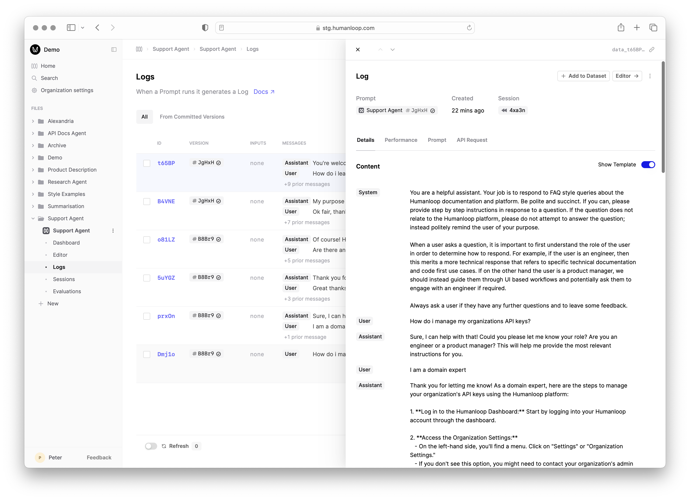
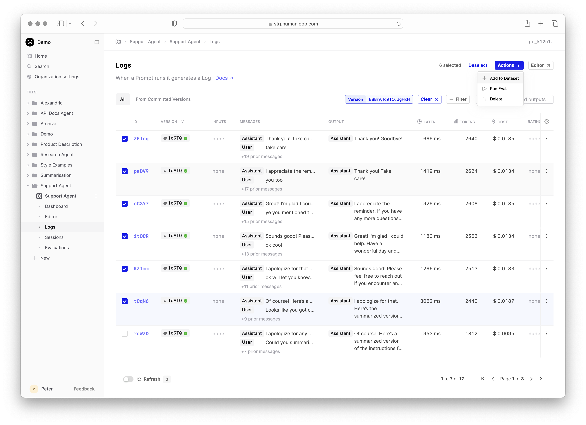
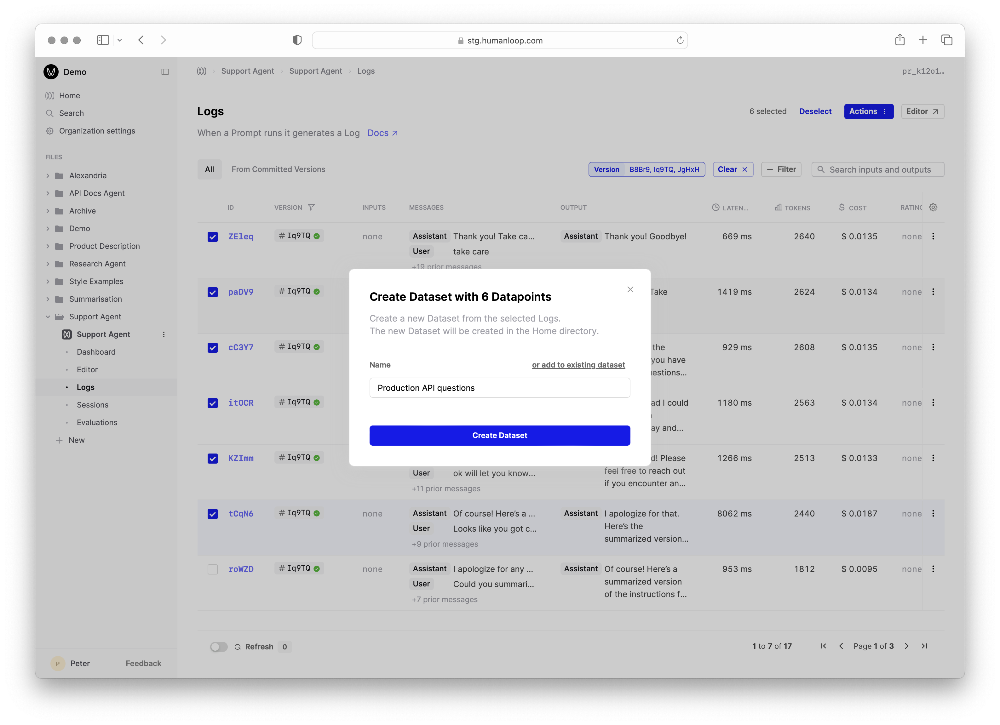
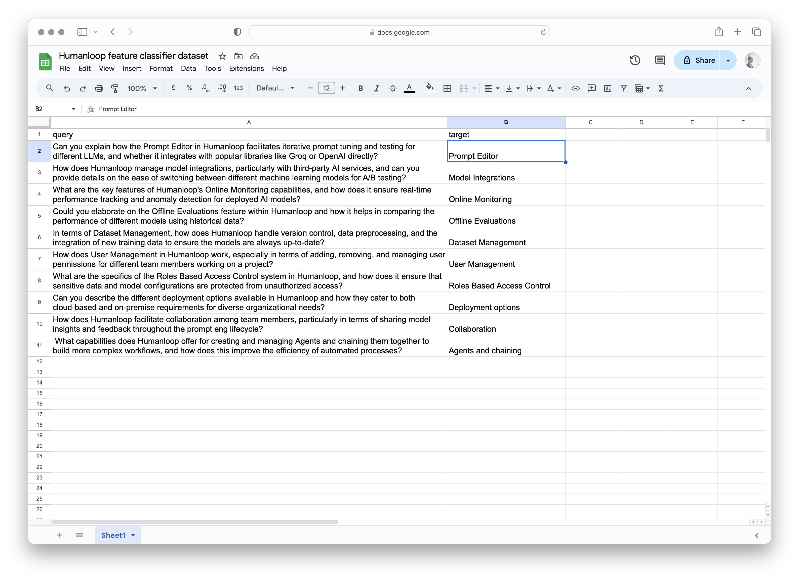

[Datasets](../../concepts/datasets) are a collection of input-output pairs that can be used to evaluate your Prompts, Tools or even Evaluators.

This guide will show you how to create Datasets in Humanloop in three different ways:

- [Create a Dataset from existing Logs](#create-a-dataset-from-logs) - useful for curating Datasets based on how your AI application has been behaving in the wild.
- [Upload data from CSV](#upload-data-from-csv) - useful for quickly uploading existing tabular data you've collected outside of Humanloop.
- [Upload via API](#upload-via-api) - useful for uploading more complex Datasets that may have nested JSON structures, which are difficult to represent in tabular .CSV format, and for integrating with your existing data pipelines.

## Create a Dataset from Logs

### Prerequisites

You should have an existing [Prompt](../../concepts/prompts) on Humanloop and already generated some [Logs](../../concepts/logs).
Follow our guide on [creating a Prompt](../../development/guides/create-prompt) to create a Prompt and generate some Logs.

### Steps
To create a Dataset from existing Logs:

<Steps>

### Navigate to the **Logs** of your Prompt
Our Prompt in this example is a Support Agent that answers user queries about Humanloop's product and docs:

### Select a subset of the Logs to add
Filter logs on a criteria of interest, such as the version of the Prompt used, then multi-select Logs.

In the menu in the top right of the page, select **Add to dataset**.

### Add to a new Dataset

Provide a name of the new Dataset and click **Create** (or you can click **add to existing Dataset** to append the selected to an existing Dataset).
Then provide a suitable commit message describing the datapoints you've added.

You will then see the new Dataset appear at the same level in the filesystem as your Prompt.

</Steps>

## Upload data from CSV

### Prerequisites:

You should have an existing [Prompt](../../concepts/prompts) on Humanloop with a variable defined with our double curly bracket syntax `{{variable}}`. If not, first follow our guide on [creating a Prompt](../../development/guides/create-prompt).

In this example, we'll use a Prompt that categorises user queries about Humanloop's product and docs by which feature it relates to.

## Steps:
To create a dataset from a CSV file, we'll first create a CSV in Google Sheets that contains values for our Prompt variable `{{query}}` and then upload it to a Dataset on Humanloop.

<Steps>
### Create a CSV file. 
   - In our Google Sheets example below, we have a column called `query` which contains possible values for our Prompt variable `{{query}}`.
   - You can include as many columns of prompt variables as you need for your model configs.
   - There is additionally a column called `target` which will populate the target of the datapoint. In this case, we use simple strings to define the target.
   - Note: `messages` are harder to incorporate into a CSV file as they tend to be verbose and hard-to-read JSON. If you want a dataset with messages, consider using the API to upload, or convert from existing logs.

### Export the Google Sheet to CSV

Choose **File** → **Download** → **Comma-separated values (.csv)**

### Create a new Dataset File

### Click **Upload CSV**

Uupload the CSV file from step 2 by drag-and-drop or using the file explorer.

### Click **Upload Dataset from CSV**

You should see a new dataset appear in the datasets tab. You can explore it by clicking in.

### Follow the link in the pop-up to inspect the dataset that was created in the upload.

You'll see a column with the input key-value pairs for each datapoint, a messages column (in our case we didn't use messages, so they're all empty) and a target column with the expected model output.

</Steps>

## Upload via API

<Markdown src="../../../snippets/setup-sdk.mdx" />

First define some sample data, this should consist of template inputs and/or user messages target extraction pairs. This is where you could load up any existing data you wish to use for your evaluation.

Then define a dataset using the datasets API:

<EndpointRequestSnippet
  endpoint="POST /datasets"
  example="CreateSupportDataset"
/>

In your Humanloop workspace, you will now see a Dataset called `support-queries` with your example data.

