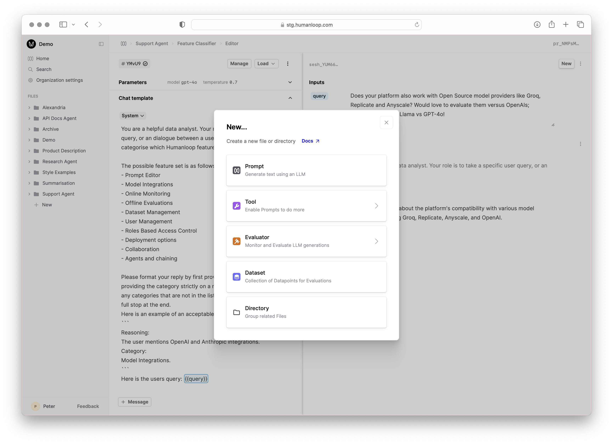
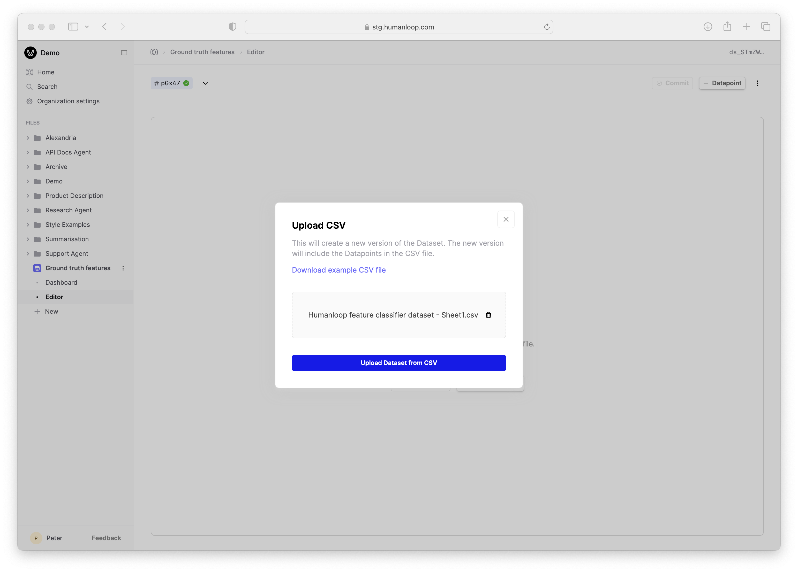
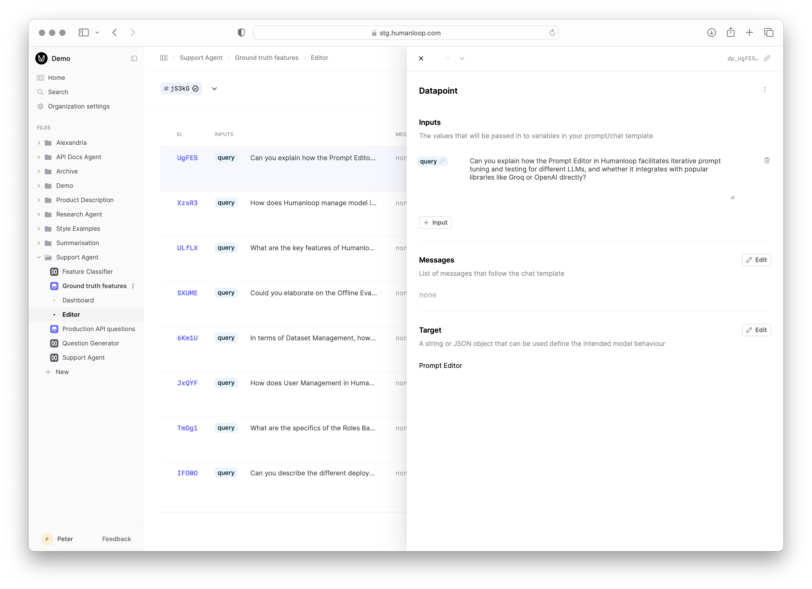
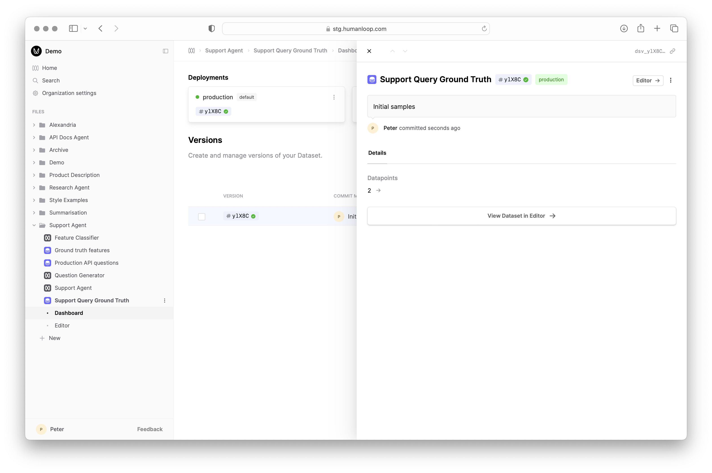

[Datasets](../../concepts/datasets) are a collection of input-output pairs that can be used to evaluate your Prompts, Tools or even Evaluators.

This guide will show you how to create Datasets in Humanloop in three different ways:

- [Create a Dataset from existing Logs](#create-a-dataset-from-logs) - useful for curating Datasets based on how your AI application has been behaving in the wild.
- [Upload data from CSV](#upload-data-from-csv) - useful for quickly uploading existing tabular data you've collected outside of Humanloop.
- [Upload via API](#upload-via-api) - useful for uploading more complex Datasets that may have nested JSON structures, which are difficult to represent in tabular .CSV format, and for integrating with your existing data pipelines.

## Create a Dataset from Logs

### Prerequisites

You should have an existing [Prompt](../../concepts/prompts) on Humanloop and already generated some [Logs](../../concepts/logs).
Follow our guide on [creating a Prompt](../../development/guides/create-prompt).

### Steps
To create a Dataset from existing Logs:

<Steps>

### Navigate to the **Logs** of your Prompt
Our Prompt in this example is a Support Agent that answers user queries about Humanloop's product and docs:

### Select a subset of the Logs to add
Filter logs on a criteria of interest, such as the version of the Prompt used, then multi-select Logs.

In the menu in the top right of the page, select **Add to dataset**.

### Add to a new Dataset

Provide a name of the new Dataset and click **Create** (or you can click **add to existing Dataset** to append the selection to an existing Dataset).
Then provide a suitable commit message describing the datapoints you've added.

You will then see the new Dataset appear at the same level in the filesystem as your Prompt.

</Steps>

## Upload a Dataset from CSV

### Prerequisites

You should have an existing [Prompt](../../concepts/prompts) on Humanloop with a variable defined with our double curly bracket syntax `{{variable}}`. If not, first follow our guide on [creating a Prompt](../../development/guides/create-prompt).

In this example, we'll use a Prompt that categorises user queries about Humanloop's product and docs by which feature it relates to.

### Steps
To create a dataset from a CSV file, we'll first create a CSV in Google Sheets that contains values for our Prompt variable `{{query}}` and then upload it to a Dataset on Humanloop.

<Steps>
### Create a CSV file. 
   - In our Google Sheets example below, we have a column called `query` which contains possible values for our Prompt variable `{{query}}`. You can include as many columns as you have variables in your Prompt template.
   - There is additionally a column called `target` which will populate the target output for the classifier Prompt. In this case, we use simple strings to define the target.
   - More complex Datapoints that contain `messages` and structured objects for targets are suppoerted, but are harder to incorporate into a CSV file as they tend to be hard-to-read JSON. If you need more complex Datapoints, [use the API](#upload-via-api) instead.

### Export the Google Sheet to CSV

In Google sheets, choose **File** → **Download** → **Comma-separated values (.csv)**

### Create a new Dataset File

On Humanloop, select *New* at the bottom of the left hand sidebar, then select *Dataset*.

### Click **Upload CSV**

First name your dataset when prompted in the sidebar, then select the **Upload CSV** button and drag and drop the CSV file you created above using the file explorer.
You will then be prompted to provide a commit message to describe the initial state of the dataset.

### Follow the link in the pop-up to inspect the Dataset created

You'll see the input-output pairs that were included in the CSV file and you can the rows to inspect and edit the individual Datapoints.

</Steps>

## Upload a Dataset via API

### Prerequisites
If you are using the SDK, the only prerequisite is to have the SDK installed and configured. If you are using the API directly, you will need to have an API key.
<Markdown src="../../../snippets/setup-sdk.mdx" />

### Steps
Using the API is a great way to integrate Humanloop with your existing data pipeline or just to once-off upload a more complex Dataset that is hard to represent in a CSV file, such as one that contains an array of messages and JSON targets.

<Steps>

### Post data to the Datasets API
We first define some sample data that contains user messages and desired responses from our [Support Agent Prompt](#create-a-dataset-from-logs) and call the `POST /datasets` endpoint to upload it as follows:

<EndpointRequestSnippet
  endpoint="POST /datasets"
  example="CreateSupportDataset"
/>

### Inspect the uploaded Dataset

After running this code, in your Humanloop workspace you will now see a Dataset called `Support Query Ground Truth` (or whatever value was in `path`) with your sample data.

</Steps>

# Next steps

🎉 Now that you have Datasets defined in Humanloop, you can leverage our [Evaluations](../overview) feature to systematically measure and improve the performance of your AI applications.
See our guides on [setting up Evaluators](./llm-judge) and [Running an Evaluation](./run-evaluation) to get started.

