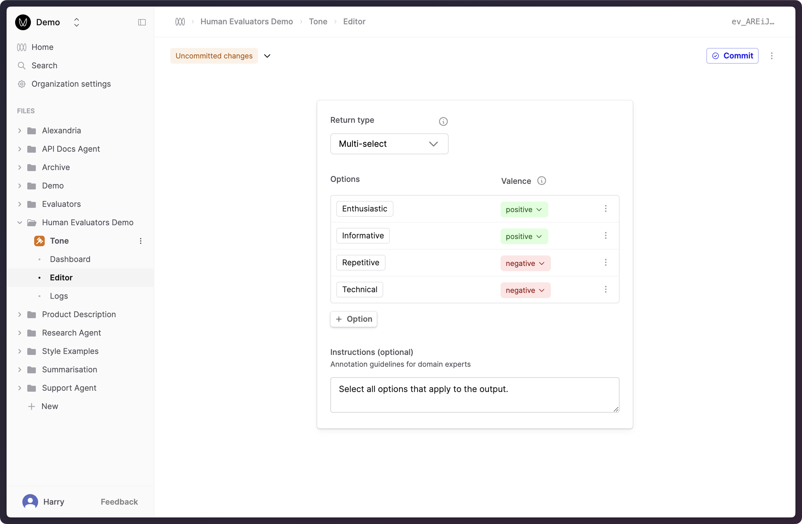

Human Evaluators allow your subject-matter experts and end-users to provide feedback on Prompt Logs.
These Evaluators can be attached to Prompts and Evaluations.

## Creating a Human Evaluator

This section will bring you through creating and setting up a Human Evaluator. 
As an example, we'll use a "Tone" Evaluator that allows feedback to be provided by
selecting from a list of options.

<Steps>

### Create a new Evaluator

- Click the **New** button at the bottom of the left-hand sidebar, select **Evaluator**, then select **Human**.

- Give the Evaluator a name when prompted in the sidebar, for example "Tone".

### Define the Judgment Schema

After creating the Evaluator, you will automatically be taken to the Editor.
Here, you can define the schema detailing the kinds of judgments to be applied for the Evaluator.
The Evaluator will be initialized to a 5-point rating scale by default.

In this example, we'll set up a feedback schema for a "Tone" Evaluator.
See the [Return types documentation](../../concepts/evaluators#return-types) for more information on return types.

- Select **Multi-select** within the **Return type** dropdown. "Multi-select" allows you to apply multiple options to a single Log.
- Add the following options, and set the valence for each:
  - Enthusiastic [positive]
  - Informative [postiive]
  - Repetitive [negative]
  - Technical [negative]
- Update the instructions to "Select all options that apply to the output."

### Commit and deploy the Evaluator

- Click **Commit** in the top-right corner.
- Enter "Added initial tone options" as a commit message. Click **Commit**.

- In the "Version committed" dialog, click **Deploy**.
- Select the checkbox for you default Environment (usually named "production"), and confirm your deployment.

</Steps>

:tada: You've now created a Human Evaluator that can be used to collect feedback on Prompt Logs.

## Next steps

- [Use Human Evaluators in Evaluations](./human-evaluation) to collect annotations on Prompt Logs from subject-matter experts.
- [Attach Human Evaluators to Prompts](../../observability/guides/capture-user-feedback) to collect end-user feedback
