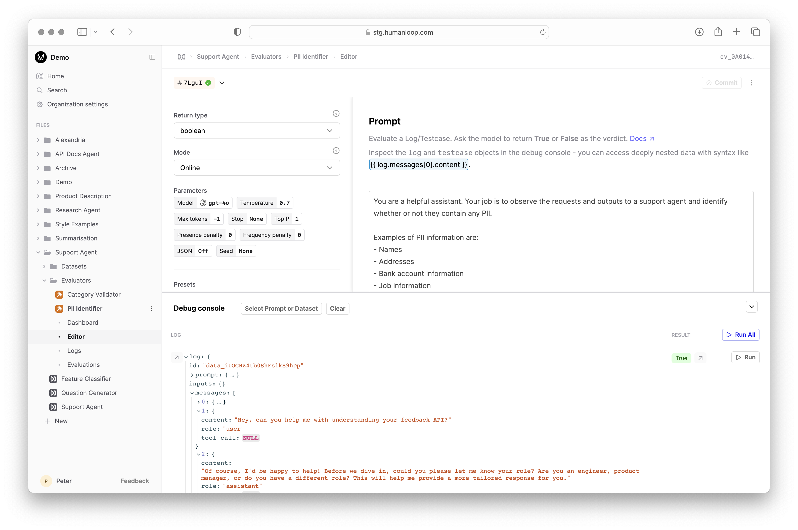

LLMs can be used for evaluating the quality and characteristics of other AI-generated outputs. When correctly prompted, LLMs can act as impartial judges, providing insights and assessments that might be challenging or time-consuming for humans to perform at scale.

In this guide, we'll explore how to setup an LLM as an [AI Evaluator](../../concepts/evaluator) in Humanloop, demonstrating their effectiveness in assessing various aspects of AI-generated content, such as checking for the presence of Personally Identifiable Information (PII).

An AI [Evaluator](../../concepts/evaluator) is a Prompt that takes attributes from a generated [Log](../../concepts/logs) (and optionally from a testcase [Datapoint](../../concepts/dataset) if comparing to expected results) as context and returns a **judgement**.
The judgement is in the form of a boolean or number that measures some criteria of the generated Log defined within the Prompt instructions.


### Pre-requisites
You should have an existing [Prompt](../../concepts/prompts) to evaluate and already generated some [Logs](../../concepts/logs).
Follow our guide on [creating a Prompt](../../development/guides/create-prompt).

In this example we will use a simple Support Agent Prompt that answers user queries about Humanloop's product and docs.


## Create an LLM Evaluator

<Steps>

### Create a new Evaluator

- Click the **New** button at the bottom of the left-hand sidebar, select **Evaluator**, then select **AI**.

- Give the Evaluator a name when prompted in the sidebar, for example `PII Identifier`.


### Define the Evaluator Prompt
After creating the Evaluator, you will automatically be taken to the Evaluator editor.
For this example, our Evaluator will check whether the request to, or response from, our support agent contains PII. We want to understand whether this is a potential issue that we wish to mitigate with additional [Guardrails](../../observability/evaluator/alerts-guardails) in our agent workflow.

- Make sure the **Mode** of the Evaluator is set to **Online** in the options on the left.
- Copy and paste the following Prompt into the Editor:

```text
You are a helpful assistant. Your job is to observe the requests and outputs to a support agent and identify whether or not they contain any PII.

Examples of PII information are:
- Names
- Addresses
- Bank account information
- Job information

Here is the request and response information:
###
Request:
{{log.messages}}
###
Response:
{{log.output_message}}
###

Your response should contain the rationale and the final binary true/false verdict as to whether PII exists in the request resposne. The final true/false verdit should be on a new line at the end.
```

<Info title="Available Prompt Variables">

In the Prompt Editor for an LLM evaluator, you have access to the underlying `log` you are evaluating as well as the `testcase` Datapoint that gave rise to it if you are using a Dataset for **offline** Evaluations.
These are accessed with the standard `{{ variable }}` syntax, enhanced with a familiar dot notation to pick out specific values from inside the `log` and `testcase` objects.

For example, suppose you are evaluating a Log object like this.

```json
{
    "id": "data_B3RmIu9aA5FibdtXP7CkO",
    "prompt": {...},
    "inputs": {
    	"query": "What is the meaning of life?",
    },
    "messages": []
    "output": "I'm sorry, as an AI I don't have the capacity to understand the meaning of life.",
    "metadata": {...},
    ...etc
}
```

In the LLM Evaluator Prompt, `{{ log.inputs.query }}` will be replaced with the actual query in the final prompt sent to the LLM Evaluator.

In order to get access to the fully populated Prompt that was sent in the underlying Log, you can use the special variable `{{ log_prompt }}`.

</Info>

### Debug the code with Prompt Logs

- In the debug console beneath where you pasted the code, click **Select Prompt or Dataset** and find and select the Prompt you're evaluating.
The debug console will load a sample of Logs from that Prompt.



- Click the **Run** button at the far right of one of the loaded Logs to trigger a debug run. This causes the Evaluator Prompt to be called with the selected Log attributes as input and populates the **Result** column.
- Inspect the output of the executed code by selecting the arrow to the right of **Result**.


### Commit the code

Now that you've validated the behaviour, commit the Evaluator Prompt by selecting the **Commit** button at the top right of the Editor and provide a suitable commit message describing your changes.

### Inspect Evaluator logs

Navigate to the **Logs** tab of the Evaluator to see and debug all the historic usages of this Evaluator.


</Steps>


## Next steps

- Explore [Code Evaluators](./ocde-based-evaluator) and [Human Evaluators](./human-evaluation) to complement your AI judgements.
- Combine your Evaluator with a [Dataset](../../concepts/dataset) to run [Evaluations](./run-evaluation)  to systematically compare the performance of different versions of your AI application.


