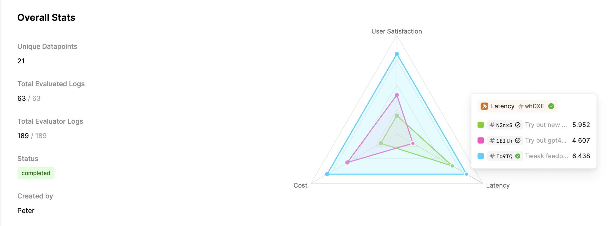
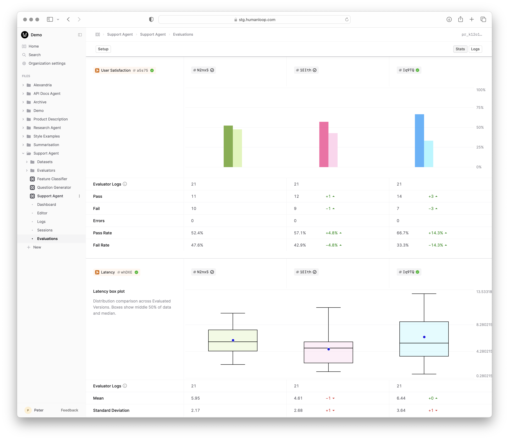
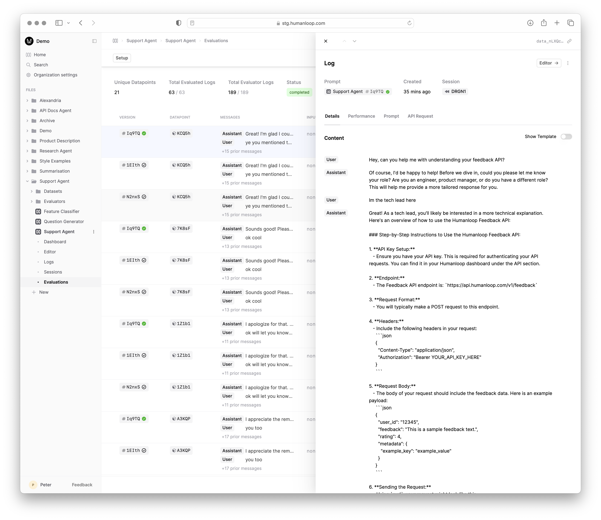

<Markdown src="../../../snippets/paid-feature.mdx" />

An **Evaluation** on Humanloop leverages a [Dataset](../../concepts/datasets), a set of [Evaluators](../../concepts/evaluators) and different versions of a [Prompt](../../concepts/prompts) to compare.

The Dataset contains testcases describing the inputs (and optionally the expected results) for a given task. The Evaluators define the criteria for judging the performance of the Prompts when executed using these inputs.

Each of the Prompt versions you want to compare are run against the same Dataset producing [Logs](../../concepts/logs); judgements are then provided by Evaluators.
The Evaluation then uses these judgements to provide a summary report of the performance allowing you to systematically compare the performance of the different Prompt versions.

## Prerequisites

- A set of [Prompt](../../concepts/prompts) versions you want to compare - see the guide on [creating Prompts](./comparing-prompt-editor).
- A [Dataset](../../concepts/datasets) containing testcases for the task - see the guide on [creating a Dataset](./create-dataset).
- At least one [Evaluator](../../concepts/evaluators) to judge the performance of the Prompts - see the guides on creating [Code](./code-based-evaluator), [AI](./llm-as-judge) and [Human](./human-evaluator) Evaluators.

<Info title={"Combining Evaluators"}>
You can combine multiple different types of Evaluator in a single Evaluation.
For example, you might use an AI Evaluator to judge the quality of the output of the Prompt and a code Evaluator to check the output is below some latency and cost threshold.
</Info>

For this example, we're going to evaluate the performance of a Support Agent that responds to user queries about Humanloop's product and documentation.
Our goal is to understand which base model between `gpt-4o`, `gpt-4o-mini` and `claude-3-5-sonnet-20240620` is most appropriate for this task.

## Run an Evaluation via UI

For **Product and AI teams**, the ability to trigger Evaluations against a Dataset within the Humanloop UI allows them to systematically compare the performance to make informed decisions on which to deploy.

<Steps>
### Navigate to the Evaluations tab of your Prompt

- On the left-hand sidebar, click on the **Evaluations** tab beneath your Prompt.
- Click the **Evaluate** button top right, which presents the setup panel for the Evaluation.

### Setup the Evaluation

- Select a Dataset using **+Dataset**.
- Add the Prompt versions you want to compare using **+Version** - note you can multi-select versions in the modal resulting in multiple columns.
- Add the Evaluators you want to use to judge the performance of the Prompts using **+Evaluator**. By default, **Cost**, **Tokens** and **Latency** Evaluators are pre-selected.
<Info title={"Log Caching"}>
By default the system will re-use Logs if they exist for the chosen Dataset, Prompts and Evaluators. This makes it easy to extend reports without paying the cost of re-running your Prompts and Evaluators.

If you want to force the system to re-run the Prompts against the Dataset producing a new batch of Logs, you can select the **Manage** button in the setup panel and choose **+New Batch**.
</Info>

- Select **Save** to trigger the Evaluation report. You will see the report below the setup panel populate with a progress bar and status pending as the Logs are generated on Humanloop.

<Tip title={"Using your Runtime"}>
This guide assumes both the Prompt and Evaluator Logs are generated using the Humanloop runtime. For certain use cases where more flexibility is required, the runtime for producing Logs
instead lives in your code - see our guide on [Logging](../../development/guides/logging), which also works with our Evaluations feature.
We have a guide for how to run Evaluations with Logs generated in your code coming soon!
</Tip>

### Review the results

It will generally take at least a couple of minutes before the Evaluation report is marked as **completed** as the system generates all the required Prompt and Evaluator Logs.

Once the report is completed, you can review the performance of the different Prompt versions using the Evaluators you selected.

- The top spider plot provides you with a summary of the average Evaluator performance across all the Prompt versions.
In our case, `gpt-4o`, although on average slightly slower and more expensive on average, is significantly better when it comes to **User Satisfaction**.

- Below the spider plot, you can see the breakdown of performance per Evaluator.

- To drill into and debug the Logs that were generated, select the **Logs** button top right of the Evaluation report.
This brings you to the Evaluation Logs table and you can filter and review logs to understand the performance better and replay Logs in our Prompt Editor.

</Steps>

## Run an Evaluation via API

For **Engineering teams**, the ability to trigger Evaluations via the API allows them to integrate the Evaluation process into their existing pipelines.

<Markdown src="../../../snippets/wip.mdx" />

[//]: # (<Steps>)

[//]: # ()
[//]: # (### Get the required IDs)

[//]: # ()
[//]: # (In order to trigger an Evaluation via the API, you will need the IDs of the Dataset, Prompts and Evaluator versions you want to include.)

[//]: # ()
[//]: # (- You can find the IDs of your Dataset, Prompts and Evaluators by navigating to the respective dashboards in the UI)

[//]: # ()
[//]: # (- Alternatively, you can use the API to list the)

[//]: # ()
[//]: # ()
[//]: # (### Trigger an Evaluation)

[//]: # ()
[//]: # (Once you have the IDs, you can populate the request to trigger an Evaluation.)

[//]: # ()
[//]: # (<EndpointRequestSnippet)

[//]: # (  endpoint="POST /datasets")

[//]: # (  example="CreateSupportDataset")

[//]: # (/>)

[//]: # ()
[//]: # (### Inspect the uploaded Dataset)

[//]: # ()
[//]: # (### Review the results)

[//]: # ()
[//]: # (You can)

[//]: # ()
[//]: # (Or you can poll the Evaluation status until it is marked as completed and then review the results.)

### Next Steps

- Incorporate this Evaluation process into your Prompt engineering and deployment workflow.
- Setup Evaluations where the runtime for producing Logs lives in your code - see our guide on [Logging](../../development/logging).
- Utilise Evaluations as part of your [CI/CD pipeline](./cicd-integration)
