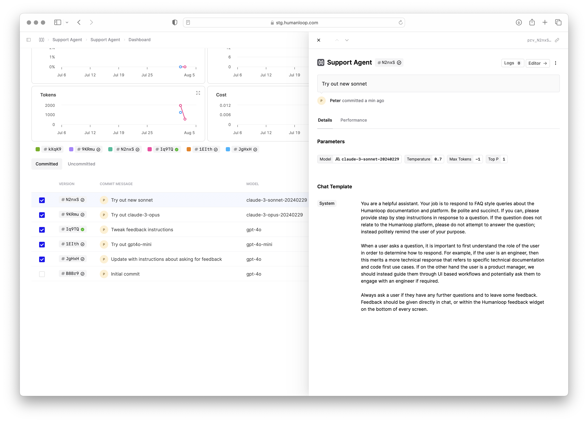
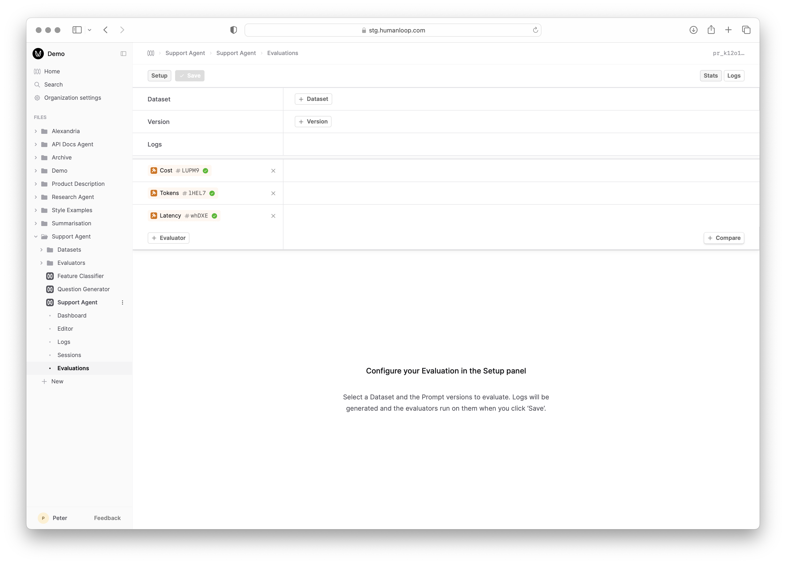
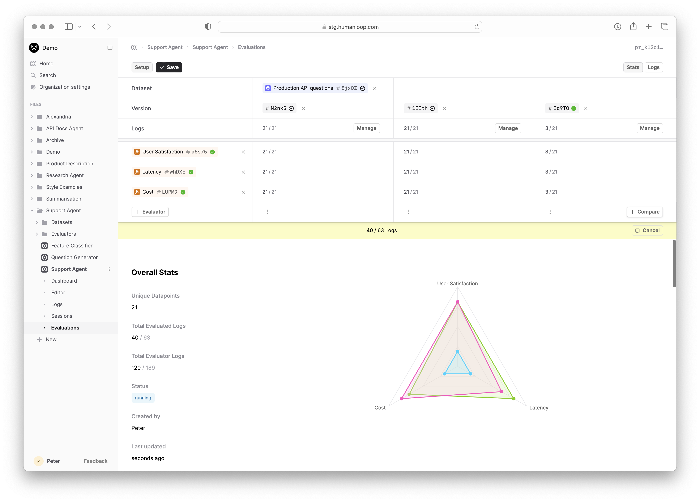

<Markdown src="../../../snippets/paid-feature.mdx" />

An **Evaluation** on Humanloop leverages a [Dataset](../../concepts/dataset), a set of [Evaluators](../../concepts/evaluator) and different versions of a [Prompt](../../concepts/prompt) to compare.

The Dataset contains testcases describing the inputs (and optionally the expected results) for a given task. The Evaluators define the criteria for judging the performance of the Prompts when executed using these inputs.

Each of the Prompt versions you want to compare are run against the same Dataset producing [Logs](../../concepts/logs); judgements are then provided by Evaluators.
The Evaluation then uses these judgements to provide a summary report of the performance allowing you to systematically compare the performance of the different Prompt versions.

## Prerequisites

- A set of [Prompt](../../concepts/prompt) versions you want to compare - see the guide on [creating Prompts](./comparing-prompt-editor).
- A [Dataset](../../concepts/dataset) containing testcases for the task - see the guide on [creating a Dataset](./creating-dataset).
- At least one [Evaluator](../../concepts/evaluator) to judge the performance of the Prompts - see the guides on creating [Code](./code-based-evaluator), [AI](./llm-judge) and [Human](./human-evaluation) Evaluators.

<Info>
You can combine multiple different types of Evaluator in a single Evaluation.
For example, you might use an AI Evaluator to judge the quality of the output of the Prompt and a code Evaluator to check the output is below some latency and cost threshold.
</Info>

For this example, we're going to evaluate the performance of a Support Agent that responds to user queries about Humanloop's product and documentation.
Our goal is to understand which base model between `gpt-4o`, `gpt-4o-mini` and `claude-3-5-sonnet-20240620` is most appropriate for this task.

### Run an Evaluation via UI

<Steps>
### Navigate to the Evaluations tab of your Prompt

- On the left-hand sidebar, click on the **Evaluations** tab beneath your Prompt.
- Click the **Evaluate** button top right, which presents the setup panel for the Evaluation.

### Setup the Evaluation

- Select a Dataset using **+Dataset**.
- Add the Prompt versions you want to compare using **+Version** - note you can multi-select versions in the modal resulting in multiple columns.
- Add the Evaluators you want to use to judge the performance of the Prompts using **+Evaluator**. By default, **Cost**, **Tokens** and **Latency** Evaluators are pre-selected.
- Select **Save** to trigger the Evaluation report. You will see the report below the setup panel populate with a progress bar and status pending as the logs are generated on Humanloop.

<Tip>
This guide assumes both the Prompt and Evaluator Logs are generated using the Humanloop runtime. For certain use cases where more flexibility is required, the runtime for producing Logs
instead lives in your code - see our guide on [Logging](../../development/logging), which also works with our Evaluations feature.
We have a guide for how to run Evaluations with Logs generated in your code coming soon!
</Tip>

### Review the results

</Steps>

### Run an Evaluation via API

### Next Steps

- [Monitor the performance of your Prompts](./monitoring-prompts)
- Utilise Evaluations as part of your [CI/CD pipeline](./cicd-integration)