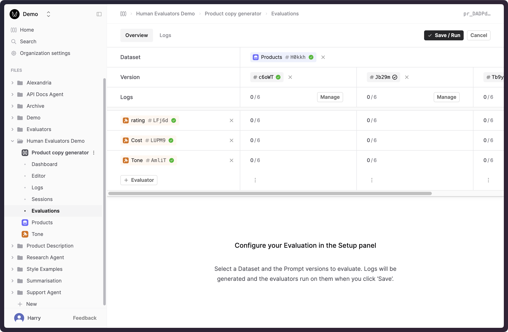
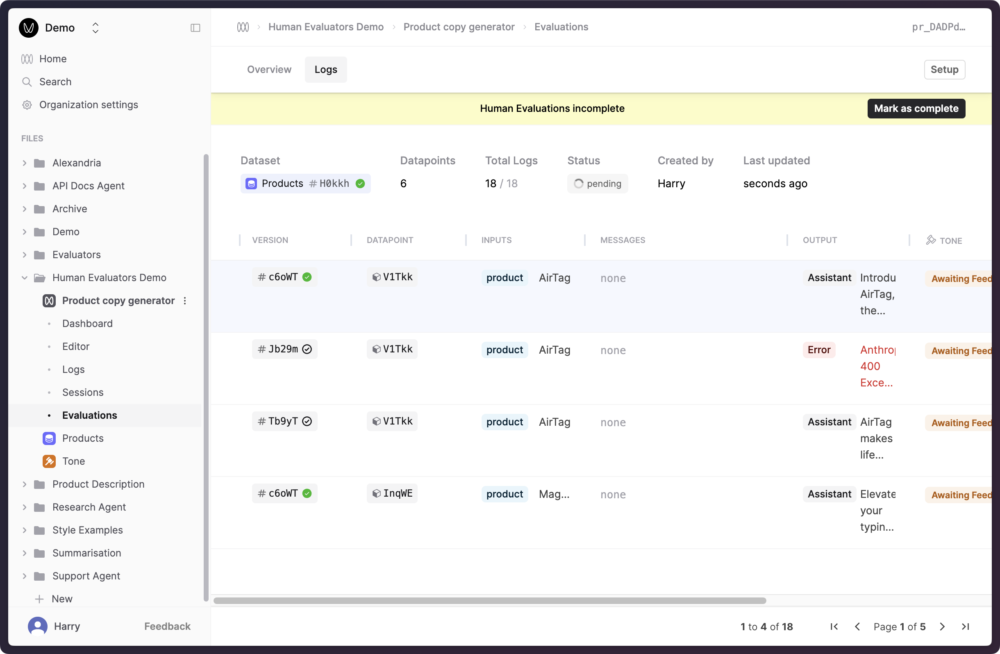
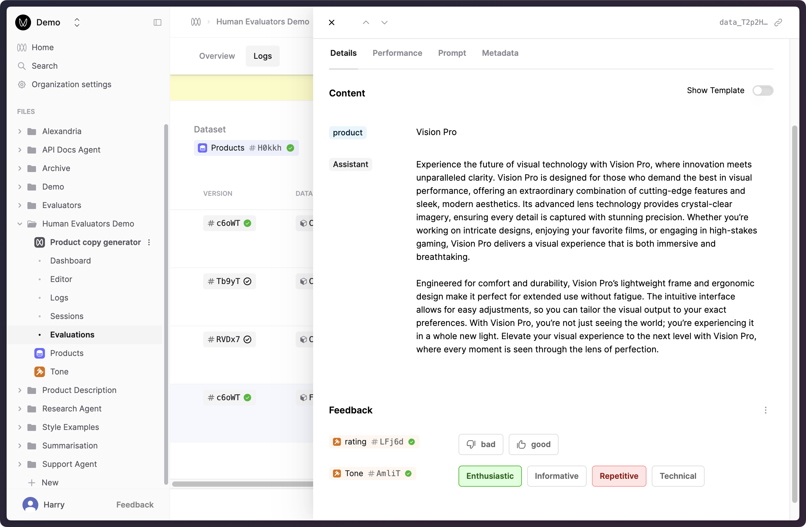
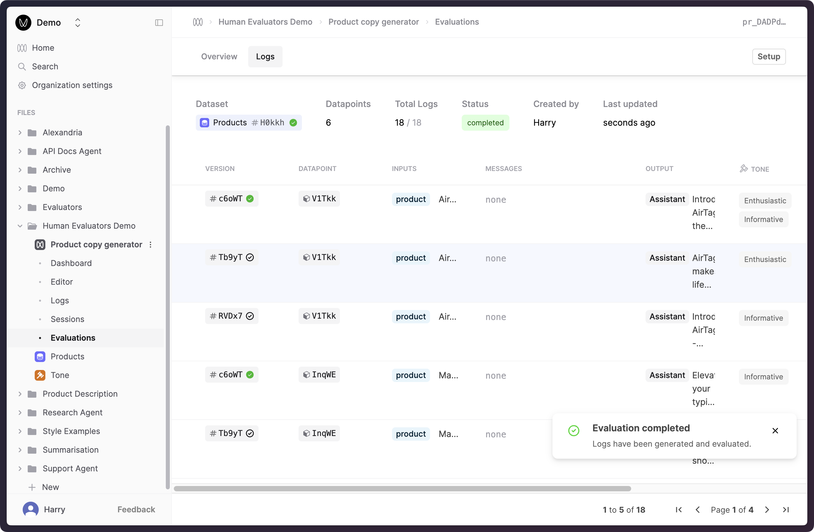
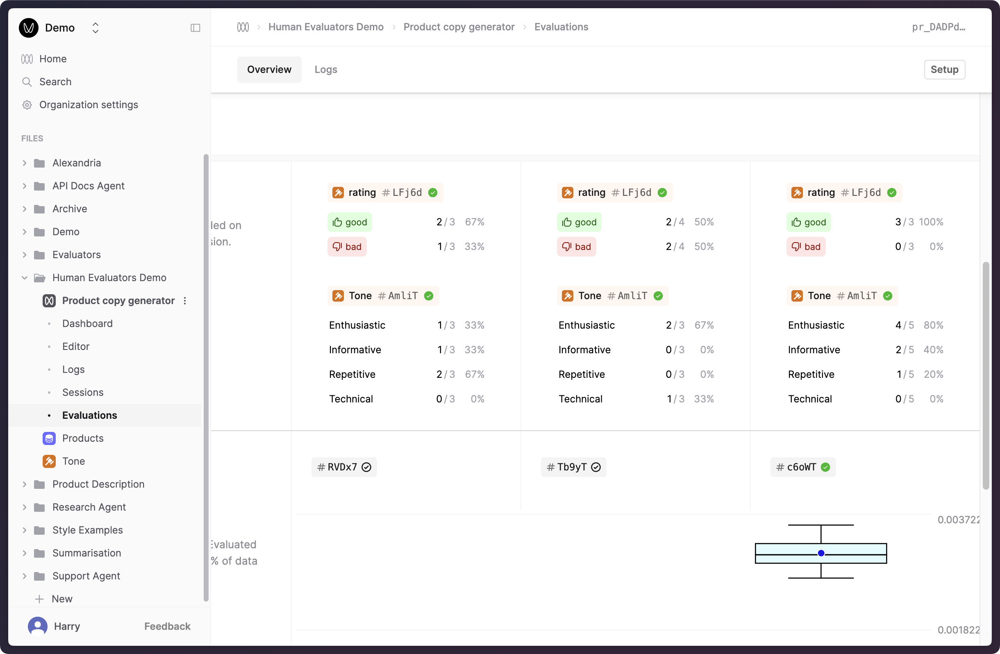

By attaching Human Evaluators to your Evaluations, you can collect annotations from your subject-matter experts
to evaluate the quality of your Prompts' outputs.

## Prerequisites

- You have set up a Human Evaluator appropriate for your use-case. If not, follow our guide to [create a Human Evaluator](/docs/v5/evaluation/guides/human-evaluators).
- You are familiar with setting up Evaluations in Humanloop. See our guide to creating [Evaluations](/docs/v5/evaluation/guides/run-evaluation).

## Using a Human Evaluator in an Evaluation

<Steps>

### Create a new Evaluation

- Go to the **Evaluations** tab of a Prompt.
- Click **Evaluate** in the top-right corner.
- Set up your Evaluation by selecting a Dataset and some Prompt versions to evaluate. See our guide to [Running an Evaluation in the UI](/docs/v5/evaluation/guides/run-evaluation#run-an-evaluation-via-ui) for more details.
- Click the **+ Evaluator** button to add a Human Evaluator to the Evaluation. This will bring up a dialog where you can select the
  Human Evaluator you created earlier. Within this dialog, select the "Tone" Evaluator, and then select its latest version which should be at the top.
- Click **+ Choose** to add the Evaluator to the Evaluation.

- Click **Save/Run** to create the Evaluation and start generating Logs to evaluate.

### Apply judgments to generated Logs

When you save an Evaluation, Humanloop will automatically generate Logs using the specified Prompt versions and Dataset.
When the required Logs are generated, a "Human Evaluations incomplete" message will be displayed in a toolbar at the top of the Evaluation.

- Go to the **Logs** tab of the Evaluation to view the generated Logs.

- Expand the drawer for a Log by clicking on the row to view the Log details. Here, you can view the generated output and apply judgments to the Log.

- When you've completed applying judgments, click on **Mark as complete** in the toolbar at the top of the page. This will update the Evaluation's status.

### Review judgments stats

Go to the **Overview** tab of the Evaluation to view the aggregate stats of the judgments applied to the Logs.
On this page, an aggregate view of the judgments provided to each Prompt version is displayed in a table, allowing you to compare the performance of different Prompt versions.

</Steps>
