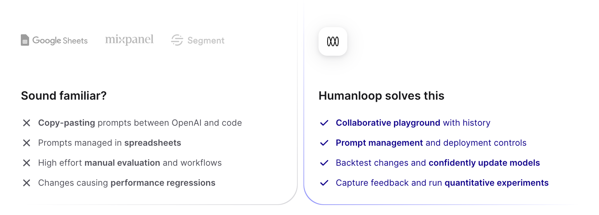

## LLMs Break Traditional Software Processes

The principal way you "program" large language models is through natural language instruction called prompts. There's a plethora of techniques needed to prompt the models to work robustly, reliably and with the correct knowledge.

Developing, managing and evaluating prompts for LLMs is surprisingly hard and dissimilar to traditional software in the following ways:

- **Subject matter experts matter more than ever.** As LLMs are being applied to all different domains, the people that know how they should best perform are rarely the software engineers but the experts in that field.
- **AI output is often non-deterministic.** Innocuous changes to the prompts can cause unforeseen issues elsewhere.
- **AI outputs are subjective**. It’s hard to measure how well products are working and so, without robust evaluation, larger companies simply can’t trust putting generative AI in production.

<Frame caption="Bad workflows for generative AI are costing you through wasted engineering effort and delays to launch">

</Frame>

Many companies struggle to enable the collaboration needed between product leaders, subject matter experts and developers. Often they'll rely on a hodge-podge of tools like the OpenAI Playground, custom scripts and complex spreadsheets. The process is slow and error-prone, wasting engineering time and leading to long delays and feelings of uncertainty.

 

 

## Humanloop solves the most critical workflows around prompt engineering and evaluation

We give you an interactive environment where your domain experts, product managers and engineers can work together to iterate on prompts. Coupled with this are tools for rigorously evaluating the performance of your AI systems.

Coding best practices still apply. All your assets are strictly versioned and can be serialised to work with existing systems like git and your CI/CD pipeline. Our TypeScript and Python SDKs seamlessly integrate with your existing codebases.

Companies like Duolingo and AmexGBT use Humanloop to manage their prompt development and evaluation so they can produce high-quality AI features and be confident that they work appropriately.

> “We implemented Humanloop at a crucial moment for Twain when we had to develop and test many new prompts for a new feature release. I cannot imagine how long it would have taken us to release this new feature without Humanloop.” – Maddy Ralph, Prompt Engineer at Twain

 

 

## Who's it for?

Humanloop is an enterprise-grade stack for product teams. We are SOC-2 compliant, offer self-hosting and never train on your data.

Product owners and subject matter experts appreciate that the Humanloop enables them to direct the AI behavior through the intuitive UI.

Developers find that Humanloop SDK/API slots well into existing code-based LLM orchestration without forcing unhelpful abstractions upon them, while removing bottlenecks around updating prompts and running evaluations.

With Humanloop, companies are overcoming the challenges of building with AI and shipping groundbreaking applications with confidence: By giving companies the right tools, Humanloop dramatically accelerates their AI adoption and makes it easy for best practices to spread around an organization.

> “Our teams use Humanloop as our development playground to try out various language models, develop our prompts, and test performance. We are still in the official onboarding process but Humanloop is already an essential part of our AI R&D process.“ – American Express Global Business Travel
