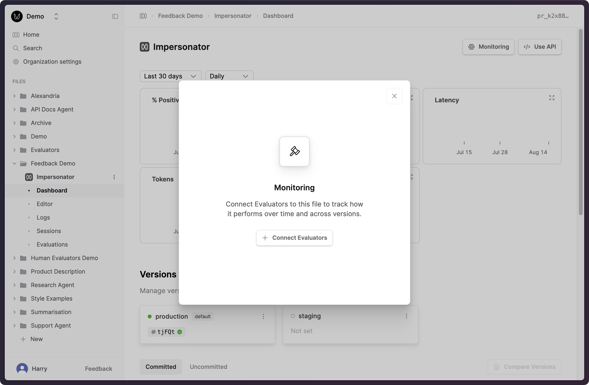
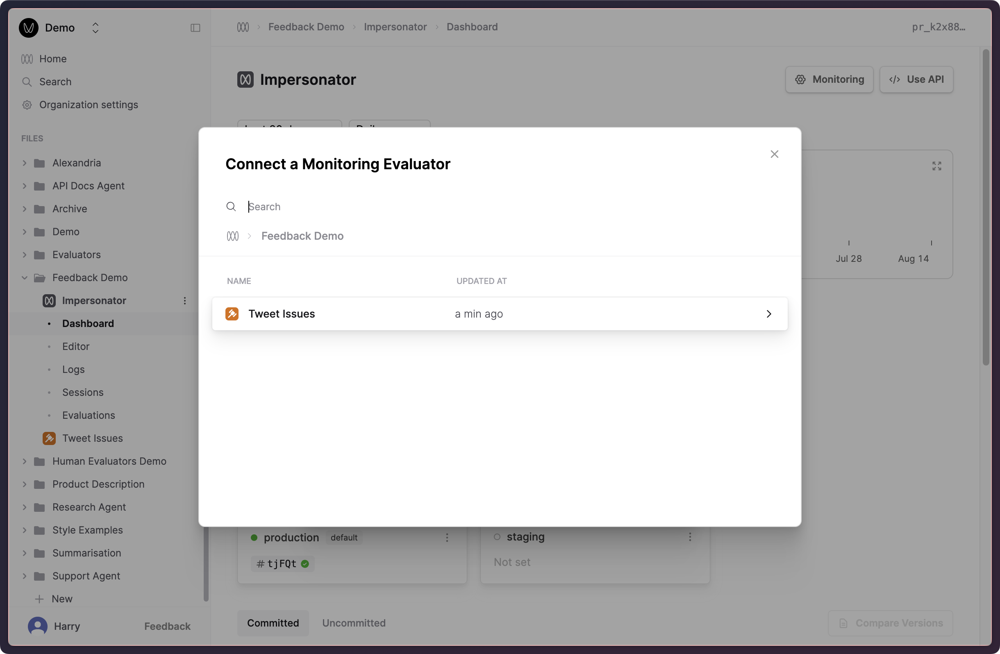
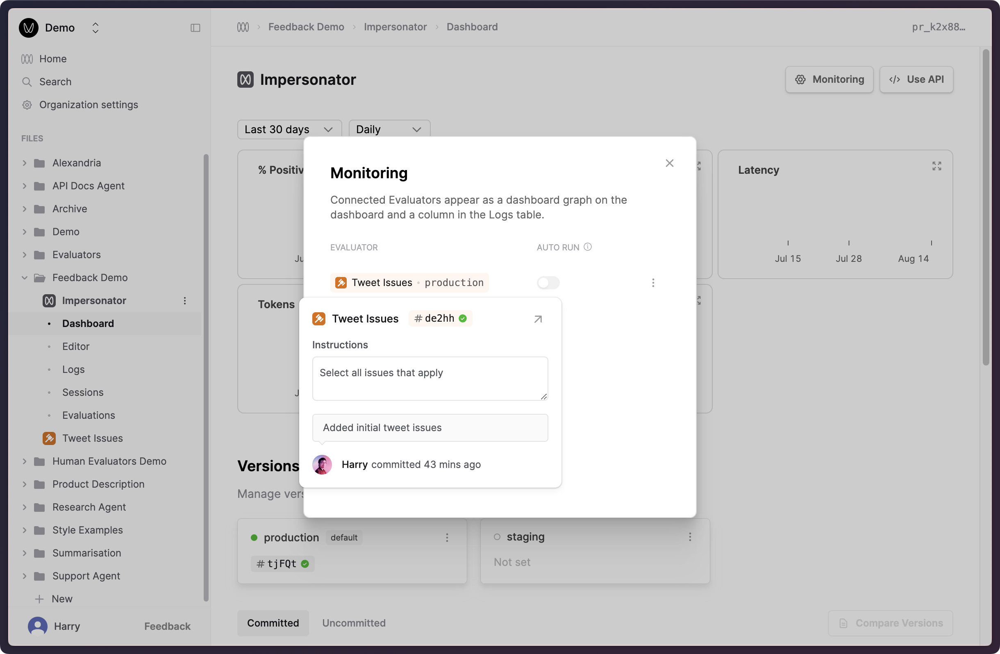
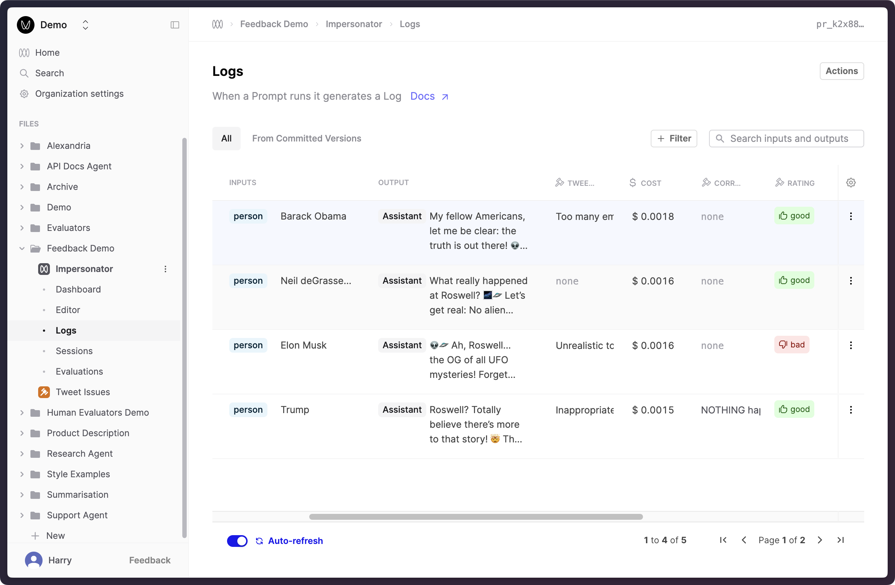
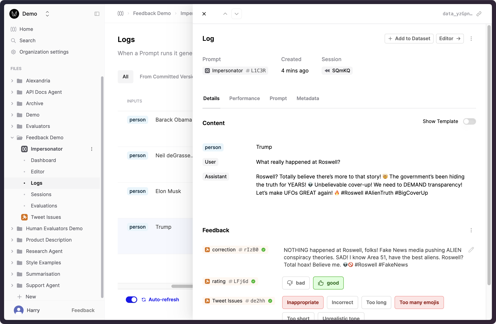
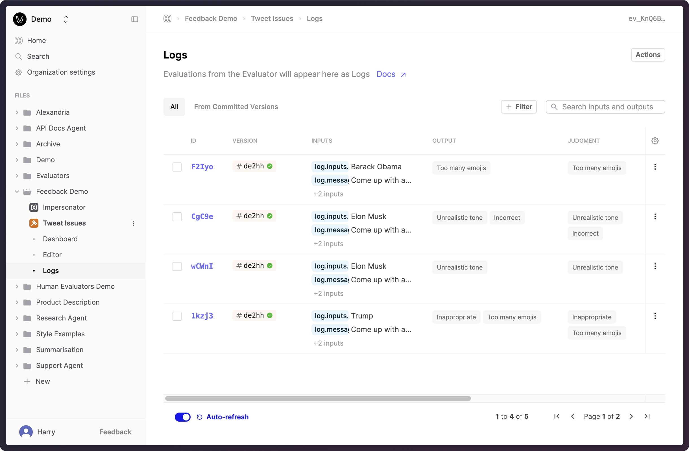

This guide shows how to use the Humanloop SDK to record end-user feedback on Logs.

<Note>

Different use-cases and user interfaces may require different kinds of feedback that need to be mapped to the appropriate end user interaction.
There are broadly 3 important kinds of feedback:

1. **Explicit feedback**: these are purposeful actions to review the generations. For example, ‘thumbs up/down’ button presses.
2. **Implicit feedback**: indirect actions taken by your users may signal whether the generation was good or bad, for example, whether the user ‘copied’ the generation, ‘saved it’ or ‘dismissed it’ (which is negative feedback).
3. **Free-form feedback**: Corrections and explanations provided by the end-user on the generation.

You should create Human Evaluators structured to capture the feedback you need.
For example, a Human Evaluator with return type "text" can be used to capture free-form feedback, while a Human Evaluator with return type "multi_select" can be used to capture user actions
that provide implicit feedback.

If you have not done so, you can follow our guide to [create a Human Evaluator](/docs/v5/evaluation/guides/human-evaluator) to set up the appropriate feedback schema.

</Note>

## Prerequisites

- You already have a Prompt — if not, please follow our [Prompt creation](/docs/guides/create-prompt) guide first.
- You have created a Human Evaluator. This can be done by following the steps in our guide to [Human Evaluator creation](/docs/v5/evaluation/guides/human-evaluation#creating-a-human-evaluator).

<Markdown src="../../../snippets/setup-sdk.mdx" />

## Attach Human Evaluator to enable feedback

In this example, we'll be attaching a "Tweet Issues" Human Evaluator to an "Impersonator" Prompt.
The specifics of the "Tweet Issues" Evaluator are not important for this guide, but for completeness, it is a Human Evaluator with the return type "multi_select" and options like "Inappropriate", "Too many emojis", "Too long", etc.

<Steps>

### Go to the Prompt's Dashboard

### Click **Monitoring** in the top right to open the Monitoring Dialog



### Click **Connect Evaluators** and select the Human Evaluator you created.



</Steps>

You should now see the selected Human Evaluator attached to the Prompt in the Monitoring dialog.



## Record feedback against a Log by its ID

With the Human Evaluator attached to the Prompt, you can now record judgments against the Prompt's Logs.
To make API calls to record feedback, you will need the Log ID of the Log you want to record feedback against.
The steps below illustrate a typical workflow for recording feedback against a Log generated in your code.

<Steps>

### Retrieve the Log ID from the `client.prompts.call()` response.

```python
log = client.prompts.call(
    version_id="prv_qNeXZp9P6T7kdnMIBHIOV",
    path="persona",
    messages=[{"role": "user", "content": "What really happened at Roswell?"}],
    inputs={"person": "Trump"},
)
log_id = log.id
```

### Call `client.evaluators.log(...)` referencing the above Log ID as `parent_id` to record user feedback.  

```python
feedback_2 = client.evaluators.log(
    # Pass the `log_id` from the previous step to indicate the Log to record feedback against
    parent_id=log_id,
    # Here, we're recording feedback against a "Tweet Issues" Human Evaluator,
    # which is of type `multi_select` and has multiple options to choose from.
    path="Feedback Demo/Tweet Issues",
    judgment=["Inappropriate", "Too many emojis"],
)

```

<Accordion title="More examples">

The "rating" and "correction" Evaluators are attached to all Prompts by default.
You can record feedback using these Evaluators as well.

The "rating" Evaluator can be used to record explicit feedback (e.g. from a 👍/👎 button).

```python
rating_log = client.evaluators.log(
    parent_id=log_id,
    # We're recording feedback using the "rating" Human Evaluator,
    # which has 2 options: "good" and "bad".
    path="rating",
    judgment="good",

    # You can also include the source of the feedback when recording it with the `user` parameter.
    user="user_123",
)
```

The "correction" Evaluator can be used to record user-provided corrections to the generations (e.g. If the user edits the generation before copying it).

```python
correction_log = client.evaluators.log(
    parent_id=log_id,
    path="correction",
    judgment="NOTHING happened at Roswell, folks! Fake News media pushing ALIEN conspiracy theories. SAD! "
    + "I know Area 51, have the best aliens. Roswell? Total hoax! Believe me. 👽🚫 #Roswell #FakeNews",
)
```

If the user removes their feedback (e.g. if the user deselects a previous 👎 feedback), you can record this by passing `judgment=None`.

```python
removed_rating_log = client.evaluators.log(
    parent_id=log_id,
    path="rating",
    judgment=None,
)
```

</Accordion>


</Steps>


## Viewing feedback

You can view the applied in two main ways: through the Logs that the feedback was applied to, and through the Human Evaluator itself.

### Viewing Feedback applied to Logs

The feedback recorded for each Log can be viewed in the **Logs** table of your Prompt.



Your internal users can also apply feedback to the Logs directly through the Humanloop app.



### Viewing Feedback through its Human Evaluator

Alternatively, you can view all feedback recorded for a specific Evaluator in the **Logs** tab of the Evaluator.
This will display all feedback recorded for the Evaluator across all other Files.



