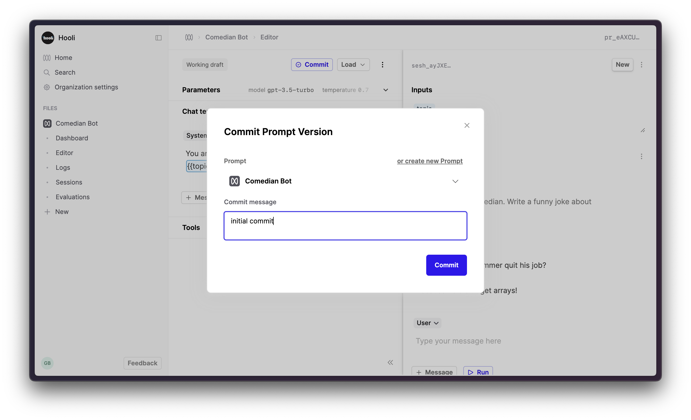

Humanloop acts as a registry of your [Prompts](/docs/prompts) so you can centrally manage all their versions and [Logs](/docs/logs), and evaluate and improve your AI systems.

This guide will show you how to create a Prompt [in the UI](#create-a-prompt-in-the-ui) or [via the SDK/API](#create-a-prompt-using-the-sdk).

<Markdown src="../../../snippets/prereq-have-account.mdx" />

## Create a Prompt in the UI

<Steps>
### Create a Prompt File

When you first open Humanloop you’ll see your File navigation on the left. Click ‘**+ New**’ and create a **Prompt**.


In the sidebar, rename this file to "Comedian Bot" now or later.

### Create the Prompt template in the Editor

The left hand side of the screen defines your Prompt – the parameters such as model, temperature and template. The right hand side is a single chat session with this Prompt.


Click the "**+ Message**" button within the chat template to add a system message to the chat template.


Add the following templated message to the chat template.

```
You are a funny comedian. Write a joke about {{topic}}.
```

This message forms the chat template. It has an input slot called `topic` (surrounded by two curly brackets) for an input value that is provided each time you call this Prompt.

On the right hand side of the page, you’ll now see a box in the **Inputs** section for `topic`.

1. Add a value for`topic` e.g. music, jogging, whatever
2. Click **Run** in the bottom right of the page

This will call OpenAI’s model and return the assistant response. Feel free to try other values, the model is _very_ funny.

You now have a first version of your prompt that you can use.

### Commit your first version of this Prompt

1. Click the **Commit** button
2. Put “initial version” in the commit message field
3. Click **Commit**



### View the logs

Under the Prompt File click ‘Logs’ to view all the generations from this Prompt

Click on a row to see the details of what version of the prompt generated it. From here you can give feedback to that generation, see performance metrics, open up this example in the Editor, or add this log to a dataset.


</Steps>

---

## Create a Prompt using the SDK

The Humanloop Python SDK allows you to programmatically set up and version your [Prompts](/docs/prompts) in Humanloop, and log generations from your models. This guide will show you how to create a Prompt using the SDK.

<Markdown src="../../../snippets/prereq-have-api-key.mdx" />

<Markdown src="../../../snippets/setup-sdk.mdx" />

Continue in the same Python interpreter (where you have run `humanloop = Humanloop(...)`).

<Warning>Note: Prompts are still called 'projects' in the SDK and versions of Prompts are called 'model configs'</Warning>
<Steps>

### Create the Prompt "project"

```python
project_response = humanloop.projects.create(name="sdk-tutorial")
project_id = project_response.id
```

### Register your version ("model config")

```python
humanloop.model_configs.register(
    project_id=project_id,
    model="gpt-3.5-turbo",
    prompt_template="Write a snappy introduction about {{topic}}:",
    temperature=0.8,
)
```

### Go to the App

Go to the [Humanloop app](https://app.humanloop.com) and you will see your new project as a Prompt with the model config you just created.

</Steps>

You now have a project in Humanloop that contains your model config. You can view your project and invite team members by going to the **Project** page.

## Next Steps

With the Prompt set up, you can now integrate it into your app by following the [uSDK/API integration guide](./generate-and-log-with-the-sdk).
