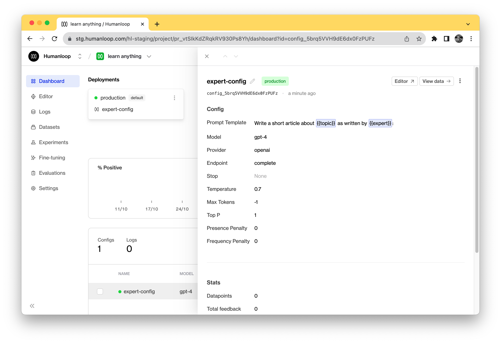
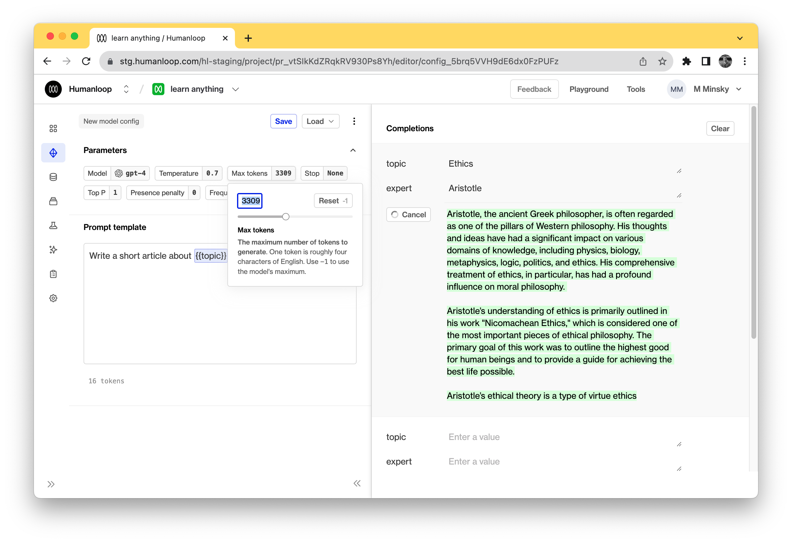
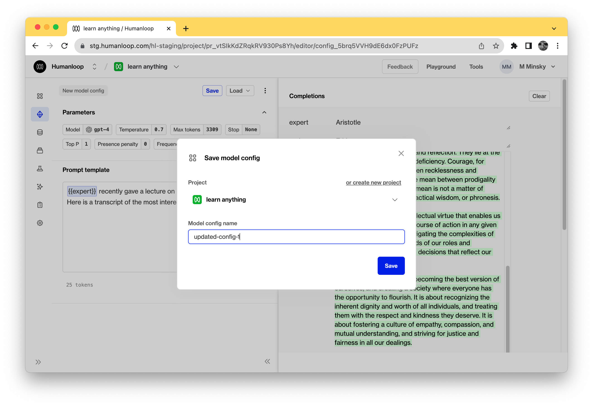

At the end of this tutorial, you’ll have created your first GPT-4 app. You’ll also have learned how to:

1. Create a Prompt
2. Use the Humanloop SDK to call Open AI GPT-4 and log your results
3. Capture feedback from your end users to evaluate and improve your model


This tutorial picks up where the [Quick Start](./quickstart) left off. If you’ve already followed the quick start you can skip to step 4 below.

## Create the Prompt

<Markdown src="../../snippets/quickstart-create-prompt.mdx" />

## Call the Prompt in an app

Now that you’ve found a good prompt and settings, you’re ready to build the "Learn anything from anyone" app! We’ve written some code to get you started — follow the instructions below to download the code and run the app.


### Setup

If you don’t have Python 3 installed, [install it from here](https://www.python.org/downloads/). Then download the code by cloning [this repository](https://github.com/humanloop/humanloop-tutorial-python) in your terminal:

```Text Python Tutorial
git clone git@github.com:humanloop/humanloop-tutorial-python.git
```

If you prefer not to use git, you can alternatively download the code using [this zip file](https://github.com/humanloop/humanloop-tutorial-python/archive/refs/heads/main.zip).

In your terminal, navigate into the project directory and make a copy of the example environment variables file.

```Text Bash
cd humanloop-tutorial-python
cp .example.env .env
```

Copy your [Humanloop API key](https://app.humanloop.com/account/settings) and set it as `HUMANLOOP_API_KEY` in your newly created .env file. Copy your [OpenAI API key](https://beta.openai.com/account/api-keys) and set it as the `OPENAI_API_KEY`.

### Run the app

Run the following commands in your terminal in the project directory to install the dependencies and run the app.

```
python -m venv venv
. venv/bin/activate
pip install -r requirements.txt
flask run
```

Open [http://localhost:5000](http://localhost:5000) in your browser and you should see the app. If you type in the name of an expert, e.g "Aristotle", and a topic that they're famous for, e.g "ethics", the app will try to generate an explanation in their style.

Press the thumbs-up or thumbs-down buttons to register your feedback on whether the generation is any good.

Try a few more questions. Perhaps change the name of the expert and keep the topic fixed.

## View the data on Humanloop

Now that you have a working app you can use Humanloop to measure and improve performance. Go back to the Humanloop app and go to your project named "learn-anything".

On the **_Models_** dashboard you'll be able to see how many data points have flowed through the app as well as how much feedback you've received. Click on your model in the table at the bottom of the page.



Click **_View data_** in the top right. Here you should be able to see each of your generations as well as the feedback that's been logged against them. You can also add your own internal feedback by clicking on a datapoint in the table and using the feedback buttons.

## Understand the code

Open up the file `app.py` in the "openai-quickstart-python" folder. There are a few key code snippets that will let you understand how the app works.

Between lines 30 and 41 you'll see the following code.

```python
expert = request.form["Expert"]
topic = request.form["Topic"]

# hl.complete automatically logs the data to your project.
complete_response = humanloop.complete_deployed(
  project="learn-anything",
  inputs={"expert": expert, "topic": topic},
  provider_api_keys={"openai": OPENAI_API_KEY}
)

data_id = complete_response.data[0].id
result = complete_response.data[0].output
```

On line 34 you can see the call to `humanloop.complete_deployed` which takes the project name and project inputs as variables. `humanloop.complete_deployed` calls GPT-4 and also automatically logs your data to the Humanloop app.

In addition to returning the result of your model on line 39, you also get back a `data_id` which can be used for recording feedback about your generations.

On line 51 of `app.py`, you can see an example of logging feedback to Humanloop.

```python
# Send feedback to Humanloop
humanloop.feedback(type="rating", value="good", data_id=data_id)
```

The call to `humanloop.feedback` uses the `data_id` returned above to associate a piece of positive feedback with that generation.

In this app there are two feedback groups `rating` (which can be `good` or `bad`) and `actions`, which here is the copy button and also indicates positive feedback from the user.

## Add a new model config

If you experiment a bit, you might find that the model isn't initially that good. The answers are often too short or not in the style of the expert being asked. We can try to improve this by experimenting with other prompts.

1. Click on your model on the model dashboard and then in the top right, click **_Editor_**

   

2. Edit the prompt template to try and improve the prompt. Try changing the maximum number of tokens using the **_Max tokens_** slider, or the wording of the prompt.
   

Here are some prompt ideas to try out. Which ones work better?

<CodeBlocks>
  ```Text Transcript from lecture
  {{ expert }} recently gave a lecture on {{ topic }}. Here is a transcript of the
  most interesting section: ``` ```Text ELI10 If {{ expert }} explained {{
    topic,
  }} to a 10 year old, they would likely say: ``` ``` Write an essay in the style
  of {{ expert }} on {{ topic }}
  ```
</CodeBlocks>

3. Click **_Save_** to add the new model to your project. Add it to the "learn-anything" project.

   

4. Go to your project dashboard. At the top left of the page, click menu of "production" environment card. Within that click the button **_Change deployment_** and set a new model config as active; calls to `humanloop.complete_deployed` will now use this new model. Now go back to the app and see the effect!


## Congratulations!

And that’s it! You should now have a full understanding of how to go from creating a Prompt in Humanloop to a deployed and functioning app. You've learned how to create prompt templates, capture user feedback and deploy a new models.

If you want to learn how to improve your model by running experiments or finetuning check out our guides below.
