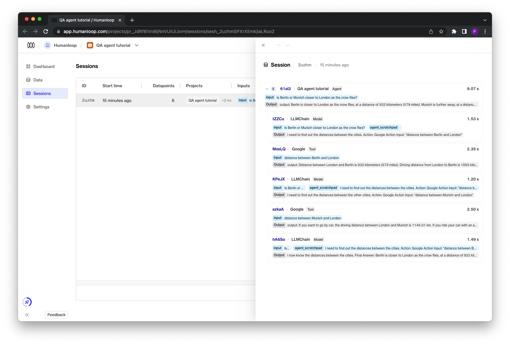
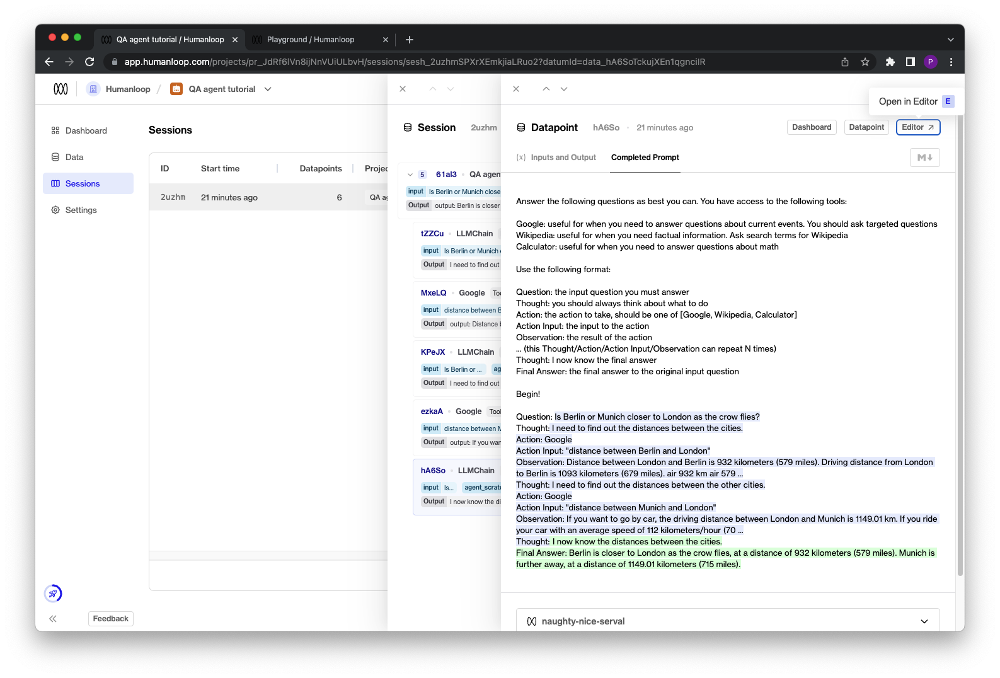
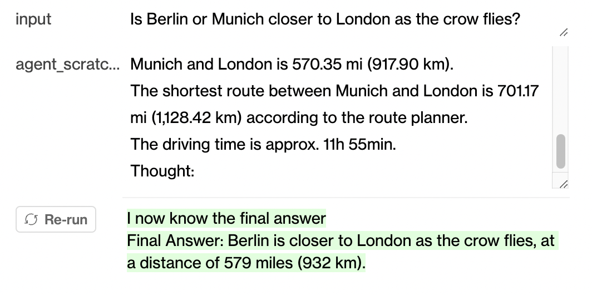
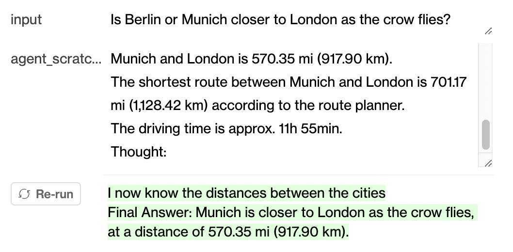

At the end of this tutorial you'll have created a [LangChain agent](https://python.langchain.com/en/latest/modules/agents.html) to answer questions that require knowledge lookup and calculations, and used Humanloop to understand and improve the agent.

## Prerequisites

- A Humanloop account - signup [here](https://app.humanloop.com/signup).
- Python installed - you can download and install Python by following the steps on the Python download page.

<Warning title="Beta Feature">
  This feature is still under development and subject to change as we get
  feedback from early users.
</Warning>

# Create an Agent

We'll begin with using the popular open source [LangChain](https://python.langchain.com/en/latest/index.html) project to prototype an agent. We'll be using a Humanloop fork of the repository while this feature is still under development in beta.

## Install LangChain fork

The Humanloop LangChain fork implements a [tracer callback](https://python.langchain.com/en/latest/tracing/agent_with_tracing.html) that sends the data from local LangChain runs to the Humanloop API in the background. We first need to install this fork using pip. In your terminal run:

```shell
pip install git+https://github.com/humanloop/langchain.git@humanloop-tracer
```

## Use LangChain

We'll now create a simple agent in LangChain for answering complex questions that has access to [tools](https://python.langchain.com/en/latest/modules/agents/tools.html) for searching [Google](https://python.langchain.com/en/latest/modules/agents/tools/examples/google_serper.html), [Wikipedia](https://python.langchain.com/en/latest/modules/agents/tools/examples/wikipedia.html) and running calculations in Python. We'll use an OpenAI [LLMChain](https://python.langchain.com/en/latest/modules/chains/generic/llm_chain.html) as the core of the agent to reason about what tools to call and how to combine the intermediary results to answer our questions.

### Set up environment

We need to first setup our Python environment starting with the required SDKs for OpenAI and the Google and Wikipedia tools. In your terminal run:

```shell
pip install openai google-search-results wikipedia
```

We now set the API keys required by `openai` and `google-search-results`, which you can get at your [OpenAI](https://platform.openai.com/account/api-keys) and your [SerpAPI](https://serpapi.com/users/sign_in) accounts respectively. In your terminal run:

```shell
export OPENAI_API_KEY="<YOUR OPENAI KEY>"
export SERPAPI_API_KEY="<YOUR SERPAPI KEY>"
```

Alternatively you can set this within your python script:

```python python
import os
os.environ["OPENAI_API_KEY"] = "<YOUR OPENAI KEY>"
os.environ["SERPAPI_API_KEY"] = "<YOUR SERPAPI KEY>"
```

### Define and run an Agent

Now let's define our agent using LangChain. Create a Python script as follows:

```python
# Import the relevant LangChain modules
from langchain import LLMMathChain, OpenAI, SerpAPIWrapper, Wikipedia
from langchain.agents import Tool, initialize_agent
from langchain.agents.react.base import DocstoreExplorer
from langchain.callbacks import StdOutCallbackHandler
from langchain.callbacks.tracers import HumanloopTracer

# Initialise the OpenAI LLM and required callables for our tools
llm = OpenAI(temperature=0)
search = SerpAPIWrapper()
llm_math_chain = LLMMathChain.from_llm(llm=llm)
docstore = DocstoreExplorer(Wikipedia())

# Define the tools to be fed to the agent
tools = [
    Tool(
        name="Google",
        func=search.run,
        description="Useful for when you need to answer questions about current events. You should ask targeted questions.",
    ),
    Tool(
        name="Wikipedia",
        func=docstore.search,
        description="Useful for when you need factual information. Ask search terms for Wikipedia",
    ),
    Tool(
        name="Calculator",
        func=llm_math_chain.run,
        description="Useful for when you need to answer questions about math.",
    ),
]

# Initialise the agent
agent = initialize_agent(tools=tools, llm=llm)
```

Next, we call the agent with a test question that requires knowledge lookup and calculation and print the result.

```python
response = agent("Is Berlin or Munich closer to London as the crow flies?")
print(response["output"])
```

```
Berlin is closer to London as the crow flies, at a distance of 932 kilometers (579 miles). Munich is further away, at a distance of 1149.01 kilometers (715 miles).
```

Is the agent correct?

# Improve the Agent

Now we turn our attention to using Humanloop to better understand what the agent is doing and then iterating on the agent configuration to improve the result.

## Configure Humanloop

First, we need to configure LangChain to turn on the Humanloop tracer. This can be achieved by just setting a couple of env variables, so requires no code changes. You'll need a Humanloop API key from your [account settings](https://app.humanloop.com/account/api-keys). In your terminal run:

```shell
export HUMANLOOP_API_KEY="<YOUR HUMANLOOP API KEY>"
export HUMANLOOP_TRACING="true"
# optionally you can also name your chain
export HUMANLOOP_APP_NAME="QA Agent"
```

Alternatively, instead of setting the env variables for `HUMANLOOP_TRACING` and `HUMANLOOP_APP_NAME`, you can explicitly initialise the Humanloop tracer in code and pass it as a callback to our agent. In your Python script adapt the agent initialisation step with:

```python Python
hl_tracer = HumanloopTracer(app_name="QA Agent")
agent(
    "Is Berlin or Munich closer to London as the crow flies?",
    callbacks=[hl_tracer]
)
```

## Inspect the trace

Now re-run your Python script with the Humanloop tracer enabled and you'll see a URL returned after the final answer from the agent:

```shell
....
> Finished chain.
 I now know the distances between the cities.

Final Answer: Berlin is closer to London as the crow flies, at a distance of 932 kilometers (579 miles). Munich is further away, at a distance of 1149.01 kilometers (715 miles).

Go to QA agent tutorials trace:
https://app.humanloop.com/projects/pr_JdRf6lVn8ijNnVUiULbvH/sessions/sesh_2uzhmSPXrXEmkjiaLRuo2
```

Click on this link to view the resulting trace on Humanloop. If this is the first time you have run this particular agent with Humanloop enabled, a Humanloop [project](./key-concepts#projects) is automatically created. Subsequent runs of the agent will add additional entries to your sessions table.



## Interact in Editor

To begin to understand where the agent may have gone wrong, we can drill into the trace and use the Humanloop `Editor` interface to iterate on variations of the prompt, model parameters and inputs:

1. Click on the final `LLMChain` step in the trace and select the `Completed Prompt` tab at the top of the datapoint drawer.
   1. From this view it's clear that the result provided by Google SerpAPI for the query _distance between Munich and London_ is truncated and does not include the necessary information to answer the question in terms of how the crow flies. In the next steps we'll correct this and see if it helps.



2. Open up this example in `Editor` by selecting the button at the top right of the drawer.
3. Add another completion test case on the right hand side of the editor by selecting the `+ Completion` button. Copy and paste the input values from the first example and change the final _Observation_ text for the `agent_scratchpad` input to instead use the full text provided by a [manual Google search](https://www.google.com/search?q=distance+between+munich+and+london&oq=distance+between+Munich+and+London&aqs=chrome.0.0i512j0i22i30j0i390i650.308j0j7&sourceid=chrome&ie=UTF-). This updated example should have all the information required by the LLM to provide the correct answer.

```
The shortest distance between Munich and London is 570.35 mi (917.90 km).
The shortest route between Munich and London is 701.17 mi (1,128.42 km) according to the route planner.
The driving time is approx. 11h 55min.
```

4. Run this test case by selecting the `>Run` button. The LLM ignores the updated information and still incorrectly says Berlin is closer as the crow flies:



5. Now we can adjust the parameters of the model in Editor to try to correct this behaviour. Select the `Parameters` tab on the left hand side. Change the base model from `text-davinci-003` to the more powerful `gpt-4` and re-run the test cases by selecting the `>Run all` button bottom right (or using the keyboard shortcut `Command + Enter`). The model now uses the updated information and provides the correct answer:



## Update the Agent

We can now update the agent definition in code with our findings from our Editor session:

1. Change the tool definition to use official [Google Search API](https://python.langchain.com/en/latest/modules/agents/tools/examples/google_search.html) instead of the [Google Serp API](https://python.langchain.com/en/latest/reference/modules/serpapi.html), which we found was providing truncated results.
   1. Follow the LangChain [tool instructions](https://python.langchain.com/en/latest/modules/agents/tools/examples/google_search.html) to set the required env variables `GOOGLE_CSE_ID`and `GOOGLE_API_KEY`.
   2. At the top of your Python script, import and change the search initialisation:

```python
# Initialise LC
from langchain import LLMMathChain, OpenAI, Wikipedia, GoogleSearchAPIWrapper
from langchain.agents import Tool, initialize_agent
from langchain.agents.react.base import DocstoreExplorer

llm = OpenAI(temperature=0)
# change to use GoogleSearchAPI instead of SerpAPI
search = GoogleSearchAPIWrapper()
llm_math_chain = LLMMathChain.from_llm(llm=llm)
docstore = DocstoreExplorer(Wikipedia())
```

2. Change the model to use GPT-4 by replacing the OpenAI initialisation in your python script with:

```python
llm = OpenAI(temperature=0, model_name="gpt-4")
```

Now when you re-run the agent and follow the link to Humanloop, you'll see new entries in your sessions table and new agent configurations on your dashboard reflecting your changes 🎉.

Try it out with some more interesting questions!
